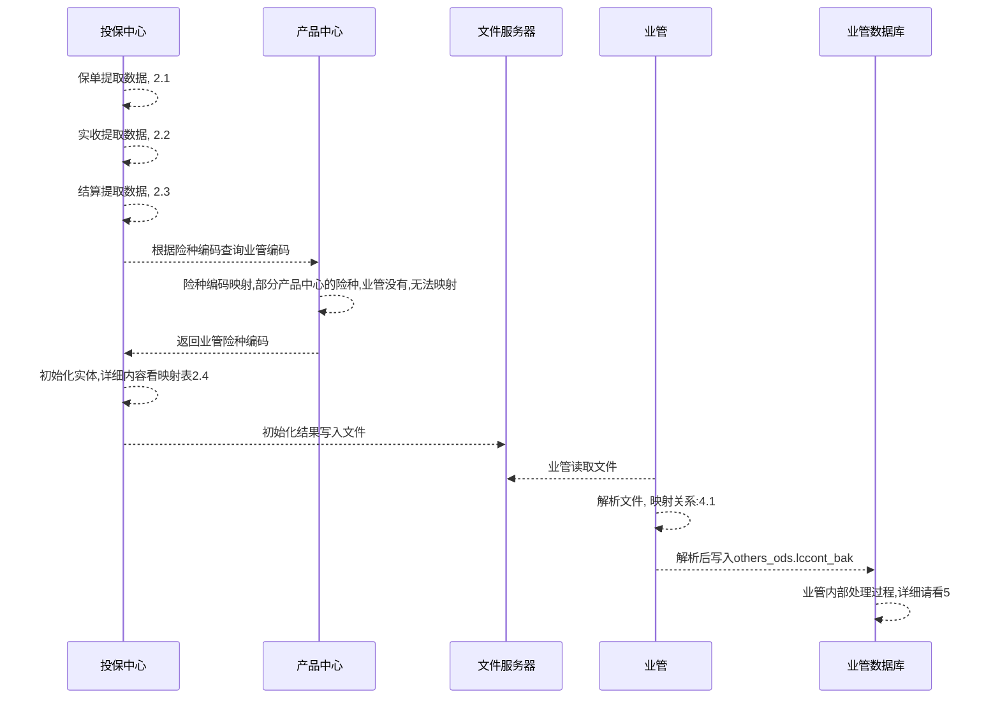
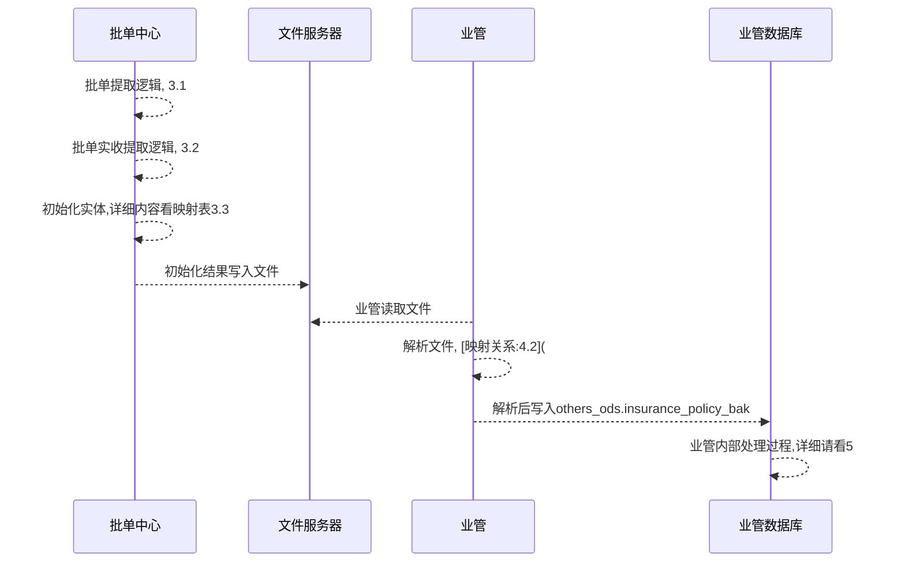
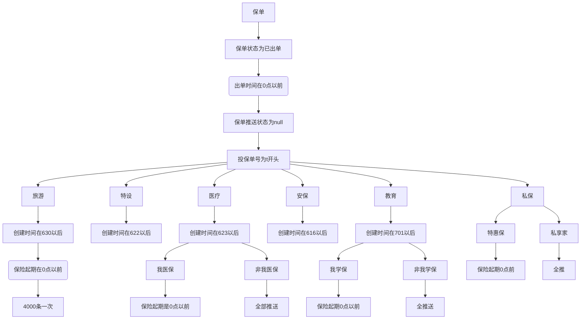
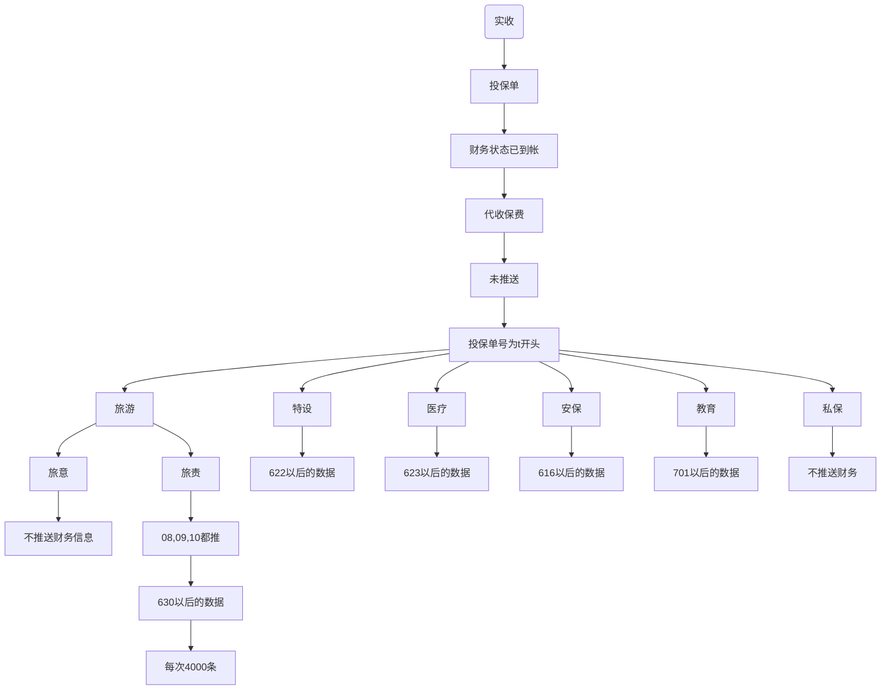
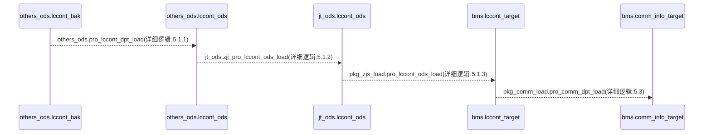
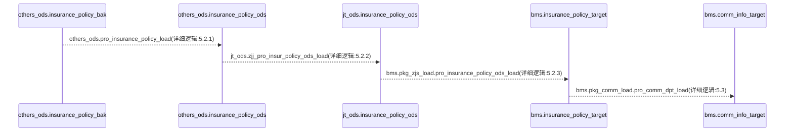
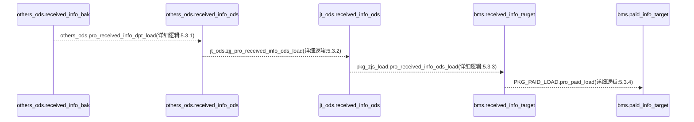

# 业管相关文档
<!-- vscode-markdown-toc -->
* 1. [bms业管数据时序图](#bms)
	* 1.1. [bms-ins投保中心保单, 实收, 结算时序图](#bms-ins)
	* 1.2. [bms-pol保单中心, 批单, 批单实收推送时序图](#bms-pol)
* 2. [ins投保中心抽数逻辑](#ins)
	* 2.1. [ins-policy保单推送](#ins-policy)
	* 2.2. [ins-finance实收推送](#ins-finance)
	* 2.3. [ins-settle结算推送](#ins-settle)
	* 2.4. [ins-mapping字段映射表](#ins-mapping)
		* 2.4.1. [policy2bmsvo映射关系](#policy2bmsvo)
		* 2.4.2. [policy2bmsfinancevo映射关系](#policy2bmsfinancevo)
* 3. [pol保单中心批单抽数逻辑](#pol)
	* 3.1. [pol-policy批单](#pol-policy)
	* 3.2. [pol-finance实收](#pol-finance)
	* 3.3. [ pol-mapping保单中心映射规则](#pol-mapping)
		* 3.3.1. [endorsement2bmsvo批单映射规则](#endorsement2bmsvo)
		* 3.3.2. [policy2bmsfinancevo批单实收映射规则](#policy2bmsfinancevo-1)
* 4. [bms-file业管文件解析](#bms-file)
	* 4.1. [大平台文件解析](#)
		* 4.1.1. [bms-ins-file保单和结算解析过程](#bms-ins-file)
		* 4.1.2. [bms-ins-finance保单实收解析过程](#bms-ins-finance)
		* 4.1.3. [bms-pol-file批单解析过程](#bms-pol-file)
		* 4.1.4. [bms-pol-finance批单实收解析过程](#bms-pol-finance)
* 5. [bms-flow业管内部处理流程](#bms-flow)
	* 5.1. [bms-flow-ins保单处理过程](#bms-flow-ins)
		* 5.1.1. [orders_ods.pro_lccont_dpt_load逻辑](#orders_ods.pro_lccont_dpt_load)
		* 5.1.2. [zjj_pro_lccont_ods_load](#zjj_pro_lccont_ods_load)
		* 5.1.3. [ pro_lccont_ods_load](#pro_lccont_ods_load)
	* 5.2. [bms-flow-pol批单处理过程](#bms-flow-pol)
		* 5.2.1. [others_ods.pro_insurance_policy_load](#others_ods.pro_insurance_policy_load)
		* 5.2.2. [jt_ods.zjj_pro_insur_policy_ods_load](#jt_ods.zjj_pro_insur_policy_ods_load)
		* 5.2.3. [pkg_zjs_load.pro_insurance_policy_ods_load](#pkg_zjs_load.pro_insurance_policy_ods_load)
	* 5.3. [pkg_comm_load(3万行)](#pkg_comm_load3)
		* 5.3.1. [pkg_comm_load.pro_comm_dpt_load](#pkg_comm_load.pro_comm_dpt_load)
	* 5.4. [bms-flow-finance实收处理过程](#bms-flow-finance)
		* 5.4.1. [others_ods.pro_received_info_dpt_load](#others_ods.pro_received_info_dpt_load)
		* 5.4.2. [jt_ods.zjj_pro_received_info_ods_load](#jt_ods.zjj_pro_received_info_ods_load)
		* 5.4.3. [pkg_zjs_load.pro_received_info_ods_load](#pkg_zjs_load.pro_received_info_ods_load)
		* 5.4.4. [pkg_paid_load.pro_paid_load](#pkg_paid_load.pro_paid_load)
* 6. [bms-config业管配置表使用规则](#bms-config)
	* 6.1. [bms.d_inscompany_rate 保险公司费率](#bms.d_inscompany_rate)
	* 6.2. [bms.d_project_fina_mapping](#bms.d_project_fina_mapping)
	* 6.3. [bms.d_exchange_rate 各币种汇率表](#bms.d_exchange_rate)
	* 6.4. [bms.d_jtorgstdrate](#bms.d_jtorgstdrate)
	* 6.5. [bms.d_projects](#bms.d_projects)
	* 6.6. [bms.d_project_fina](#bms.d_project_fina)
	* 6.7. [bms.d_bank_mapping](#bms.d_bank_mapping)
	* 6.8. [bms.d_risk](#bms.d_risk)
	* 6.9. [bms.d_inscompany](#bms.d_inscompany)
	* 6.10. [bms.d_payment_rules](#bms.d_payment_rules)
	* 6.11. [bms.dpt_product](#bms.dpt_product)
	* 6.12. [bms.d_systems](#bms.d_systems)
	* 6.13. [others_ods.d_chanle_type](#others_ods.d_chanle_type)
	* 6.14. [bms.d_currency_mapping](#bms.d_currency_mapping)
	* 6.15. [bms.d_channels](#bms.d_channels)
	* 6.16. [bms.d_jtorg_mapping](#bms.d_jtorg_mapping)
	* 6.17. [bms.d_inscompany_mapping](#bms.d_inscompany_mapping)
	* 6.18. [bms.d_district_mapping](#bms.d_district_mapping)
	* 6.19. [bms.d_district_info](#bms.d_district_info)
	* 6.20. [bms.d_project_department](#bms.d_project_department)
* 7. [业管Oracle调度逻辑](#Oracle)
	* 7.1. [调度执行计划](#-1)
		* 7.1.1. [339](#-1)
		* 7.1.2. [340](#-1)
		* 7.1.3. [341](#-1)
		* 7.1.4. [342](#-1)
		* 7.1.5. [343](#-1)
		* 7.1.6. [344](#-1)
		* 7.1.7. [345](#-1)
		* 7.1.8. [346](#-1)
	* 7.2. [调度中使用存储过程](#-1)
		* 7.2.1. [ PRO_INTO_TARGET_ETL_2019](#PRO_INTO_TARGET_ETL_2019)
		* 7.2.2. [ pro_into_voucher_js](#pro_into_voucher_js)
		* 7.2.3. [ pro_truncate_tmp](#pro_truncate_tmp)
		* 7.2.4. [ pkg_voucher_load.pro_voucher_load](#pkg_voucher_load.pro_voucher_load)
		* 7.2.5. [ pro_seq_reset](#pro_seq_reset)
		* 7.2.6. [ ro_base_data_mapping](#ro_base_data_mapping)
		* 7.2.7. [ pro_into_tar_etl_jg](#pro_into_tar_etl_jg)

<!-- vscode-markdown-toc-config
	numbering=true
	autoSave=true
	/vscode-markdown-toc-config -->
<!-- /vscode-markdown-toc -->

##  1. <a id='bms'></a>bms业管数据时序图

###  1.1. <a id='bms-ins'></a>bms-ins投保中心保单, 实收, 结算时序图



###  1.2. <a id='bms-pol'></a>bms-pol保单中心, 批单, 批单实收推送时序图
- 业管险种编码,使用保单中的业管险种编码


##  2. <a id='ins'></a>ins投保中心抽数逻辑

- 投保中心抽数逻辑分为, 保单, 实收, 结算三部分

###  2.1. <a id='ins-policy'></a>ins-policy保单推送

- push2bms



###  2.2. <a id='ins-finance'></a>ins-finance实收推送

- push2bmsfinance



###  2.3. <a id='ins-settle'></a>ins-settle结算推送

- push2bmspolicy


###  2.4. <a id='ins-mapping'></a>ins-mapping字段映射表

- 保单和结算, 用的同一个实体, policy2bmsvo

####  2.4.1. <a id='policy2bmsvo'></a>policy2bmsvo映射关系

业管字段 | 名称 | 投保中心字段 | 旅游 | 医疗 | 教育 | 特设 | 私保 | 安保
---|---|---|---|---|---|---|---|---
contno|统一保单号|risk.id||||||
application_form_code|投保单编号|app.applicationformcode||||||
insurance_policy_no|保单号|policy.insurancepolicyno||||||
system_code|来源系统编码||tour2019|med2019|edu2019|sequip2019|sales2017|safety2011
type|来源细类||4|4|4|4|2|4
project_code|项目编码|app.projectcode||||||
branch_id|分支机构id|app.branchcode||||||
branch_name|分支机构名称|app.branchname||||||
customer_code|客户编码|policyholdercode||||||
customer_name|客户名称|policyholdername||00==channeltype?insured.name||||
channer_code|渠道编码||tour|med|edu|sequip|private|safety
renewal|是否续保|app.renewal||||||
apply_date|保单投保时间|app.applicantstartdate||||||
issue_time|出单指示时间|policy.issuedate||||||
sign_time|保单签发日期|policy.issuedate||||||
broker_id|经纪人编码|agent.smsagentcode||||||
broker_name|经纪人名称|agent.agentname||||||
riskcode|险种|risk.code||||||
riskname|险种|channeltype?channeltype:""||||||
start_date|保单起期|risk.startdate?risk.startdate:app.startdate||||||
end_date|保单止期|risk.enddate?risk.enddate:app.enddate||||||
coverage|总保额|risk.amount||||||
premium|保单总保费||actualprem?actualprem:afterprem|actualprem?actualprem:afterprem|app.actualprem|actualprem?actualprem:afterprem|risk.getactualprem|applicationform.getactualprem
premium_currency|币种|cny||||||
applicant|投保人|policyholdername||||||
ddate|时间戳|数据日期, 格式yyyy-mm-dd||||||
application_form_id|投保单id|risk.getid||||||
c_chongz_flag|冲正标识|n||||||
insurant|被保险人|||||||
insurer_code|出单保险公司id|company.code||||||
agentcode|员工编码|agent.smsagentcode||||||
c_cooperation_name|协作机构名称|risk.getpaymentperiodtype||||||
c_cooperation_type|协作费用支付方式|risk.getpaymentperiodtype||||||
c_chongz_num|冲正期次|0||||||
c_is_settled|是否生成结算单|n||||||
c_dept_id|客户经理部门id|agent.getdepartcode||||||
c_dept_name|客户经理部门名称|agent.getdepartname||||||
agreement_no|委托协议号|app.getcontractno||||||
agreement_start_date|委托协议开始日期|app.contractstartdate||||||
agreement_end_date|委托协议结束日期|app.contractenddate||||||
business_no|营业执照号或委托人身份证号|app.consignor||||||
business_name|营业公司名称或委托人|app.consignoridno||||||
product_code|产品编码|app.productcode||||||
product_name|产品名称|app.productname||||||
categorize_one|一级分类|||||||
categorize_two|二级分类||productname|||||
categorize_three|三级分类||productcategory3|||||
district_id|省编码||app.citycode|||||
district_name|城市编码||app.provincecode|||||
c_pay_type|城市编码||tordercharge.getpaychannel|||||
oper_id|医疗机构等级/学校类型|||s_i_000077|s_h_000004|||
oper_name|学制||||s_h_000003|||
c_channel_detail|业管险种编码||||risk.outercode(产品中心获取)|||

```
映射问题:
1. 学校类型, 学制, 映射有问题
2. 省编码跟城市编码, 映射反了
3. 二级分类中传的是productname
```

####  2.4.2. <a id='policy2bmsfinancevo'></a>policy2bmsfinancevo映射关系

业管字段 | 字段名 | 投保中心映射字段 | 安保 | 旅游 | 特设 | 教育 | 医疗 | 私保
---|---|---|---|---|---|---|---|---
apply_date | 投保时间 | app.applicationstartdate |  |  |  |  |  | 
c_account_code | 账户号 | app.channeltype |  |  |  |  |  | 
c_account_name | 账户名 |  |  |  |  |  |  | 
c_application_form | 投保单id | app.applicationformcode |  |  |  |  |  | 
c_bank_code | 银行编码（） |  |  |  |  |  |  | 
c_bank_name | 银行名称 |  |  |  |  |  |  | 
c_branch_code | 分支机构id | app.branchcode |  |  |  |  |  | 
c_branch_name | 分支机构 | app.branchname |  |  |  |  |  | 
c_channel_code | 渠道编码 |  | safety | tour | sequip | edu | med | 
c_channel_detail | 是否是渠道业务 |  |  |  |  |  |  | 
c_channel_name | 渠道 |  | 安全生产渠道 | 旅游渠道 | 特种设备渠道 | 教育渠道 | 卫生渠道 | 
c_chongz_flag | 冲正标识 | n |  |  |  |  |  | 
c_chongz_num | 冲正期次 | 0 |  |  |  |  |  | 
c_city_code | 地区编码 | app.citycode |  |  |  |  |  | 
c_city_name | 地区名称 | app.cityname |  |  |  |  |  | 
c_comp_id | 保险公司编码 | company.code |  |  |  |  |  | 
c_comp_name | 保险公司名称 | company.name |  |  |  |  |  | 
c_compliance_flag | 是否继续合规 | 0 |  |  |  |  |  | 
c_contract_no | 合同号 |  |  |  |  |  |  | 
c_create_time | 创建时间 |  |  |  |  |  |  | 
c_currecy | 币种 | bb01 |  |  |  |  |  | 
c_customer_code | 客户编码 | holder.getholdercode |  |  |  |  |  | 
c_customer_name | 客户名称 | holder.holdername |  |  |  |  | insurant | 
c_dept_id | 部门编码 | agent.deptcode |  |  |  |  |  | 
c_dept_name | 部门名称 | agent.deptname |  |  |  |  |  | 
c_endorsement_code | 批单号 |  |  |  |  |  |  | 
c_etl_type | 抽取类型 |  |  |  |  |  |  | 
c_insurance_code | 保单号 | policy.insurancepolicyno |  |  |  |  |  | 
c_issue_com_id | 出单公司id | company.code |  |  |  |  |  | 
c_issue_com_name | 出单保险公司 | company.name |  |  |  |  |  | 
c_modify_time | 修改时间 |  |  |  |  |  |  | 
c_note | 系统中细类旅游中1旅责2旅意3导游4赴台游 |  |  |  |  |  |  | 
c_pay_type | 支付方式 | app.paychannel |  |  |  |  |  | 
c_project_code | 项目编码 | app.projectcode |  |  |  |  |  | 
c_project_name | 项目名称 | app.projectname |  |  |  |  |  | 
c_qici | 第几期缴费 | 1 |  |  |  |  |  | 
c_sfds | 是否代收保费1代收保费0不是代收保费 | 1 |  |  |  |  |  | 
c_system_code | 信息系统编码 |  | safety2011 | tour2019 | sequip2019 | edu2019 | med2019 | 
c_system_name | 信息系统名称 |  | 安保大平台 | 旅保大平台 | 特设大平台 | 教保大平台 | 医疗大平台 | 
c_unite_policy | 投保单号 | app.id |  |  |  |  |  | 
c_zongqishu | 总期数 | 1 |  |  |  |  |  | 
categorize_one | 一级分类 |  |  |  |  |  |  | 
categorize_three | 三级分类 | app.productcategory3 |  |  |  |  |  | 
categorize_two | 二级分类 | app.productname |  |  |  |  |  | 
d_create_date | 创建日期 |  |  |  |  |  |  | 
d_current_date | 到账时间 | app.paydate |  |  |  |  |  | 
d_date | 时间戳--推送日期 | 当前时间前一天日期 |  |  |  |  |  | 
d_modify_date | 修改日期 |  |  |  |  |  |  | 
end_date | 止保时间 | app.enddate |  |  |  |  |  | 
endorsement_apply_no | 批单申请号 |  |  |  |  |  |  | 
id | 序列号 | app.id |  |  |  |  |  | 
n_policy_prem | 保单保费 |  |  |  |  |  |  | 
n_receivable_premium | 实收保费 | app.actualprem |  |  |  |  |  | 
n_remaind_prem | 剩余未支付的保费（应收-实收） |  |  |  |  |  |  | 
n_shouqi_prem | 首期保费 | app.actualprem |  |  |  |  |  | 
n_xuqi_prem | 续期保费 |  |  |  |  |  |  | 
product_code | 产品编码 | app.productcode |  |  |  |  |  | 
sign_time | 签单时间 | policy.issuedate |  |  |  |  |  | 
start_date | 起保时间 | app.startdate |  |  |  |  |  | 

##  3. <a id='pol'></a>pol保单中心批单抽数逻辑

###  3.1. <a id='pol-policy'></a>pol-policy批单
- 流程与保单的相同

###  3.2. <a id='pol-finance'></a>pol-finance实收
- 流程与保单的相同

###  3.3. <a id='pol-mapping'></a> pol-mapping保单中心映射规则
- 流程与保单的相同

####  3.3.1. <a id='endorsement2bmsvo'></a>endorsement2bmsvo批单映射规则

业管字段 | 字段名 | 批单中心映射字段 | 安保 | 旅游 | 特设 | 教育 | 医疗 | 私保
--- | --- | --- | --- | --- | --- | --- | --- | ---
contno | 统一保单号 | endorsementsinfo.getid() |  |  |  |  |  | 
id | 序列号 | busapplicationform.getid() |  |  |  |  |  | 
mli_insurance_endorsement_no | 批单号 | endorsementsinfo.getendorsementsno() |  |  |  |  |  | 
endorsement_apply_no | 批单申请号 | endorsementsinfo.getapplyno() |  |  |  |  |  | 
endorsement_type | 批单类型 | endorsementsinfo.getendorsementstype() |  |  |  |  |  | 
application_form_id | 投保单id | "" |  |  |  |  |  | 
application_form_code | 投保单号 | endorsementsinfo.getapplicationformcode() |  |  |  |  |  | 
insurance_policy_no | 保单号 | endorsementsinfo.getinsuranceno() |  |  |  |  |  | 
status | 批单状态 | endorsementsinfo.getstatus() |  |  |  |  |  | 
effective_date | 批单生效日期 | endorsementsinfo.getvaliddate() |  |  | endorsementsinfo.getissuedate() |  |  | 
system_code | 信息系统编码 |  | safety2011 | tour2019 | sequip2019 | edu2019 | med2019 | sales2017
type | 系统细类 |  | 4 | 4 | 4 | 4 | 4 | 2
ddate | 时间戳 | endorsementsinfo.getapplydate() |  |  |  |  |  | 
d_create_date | 创建日期 | "" |  |  |  |  |  | 
c_create_time | 创建时间 | "" |  |  |  |  |  | 
d_modify_date | 修改日期 | "" |  |  |  |  |  | 
c_modify_time | 修改时间 | "" |  |  |  |  |  | 
c_chongz_flag | 冲正标识 固定值，n：原始保单，1：冲负，2：新生成的正记录 | n |  |  |  |  |  | 
c_compliance_flag | 合规标识 | "" |  |  |  |  |  | 
premium_change | 保费变动金额 | paypremium?paypremium:batchpremium?batchpremium:0 |  |  |  |  |  | 
endorsement_apply_date | 批单申请日期 | endorsementsinfo.getapplydate() |  |  |  |  |  | 
c_extract_type | 抽取类型 | "" |  |  |  |  |  | 
endorcommchgmoney | 批单变动佣金 | "" |  |  |  |  |  | 
reinsoutpremchgmoney | 批单变动分出保费 | "" |  |  |  |  |  | 
reinsinpremchgmoney | 批单变动分入保费 | "" |  |  |  |  |  | 
branch_id | 分支机构id | endorsementsinfo.getbranchcode() |  |  |  |  |  | 
c_system_name | 来源系统编码 | "" |  |  |  |  |  | 
c_channer_code | 渠道编码 | endorsementsinfo.getchannelcode() |  |  |  |  |  | 
c_channer_name | 渠道名称 | endorsementsinfo.getchannelname() |  |  |  |  |  | 
c_isinner | 是否内部批改 | "" |  |  |  |  |  | 
c_chongz_num | 冲正序号，由0开始的序列 初始值为0 | 0 |  |  |  |  |  | 
c_is_settled | 是否生成结算单 | "" |  |  |  |  |  | 
start_date | 批单起期 | endorsementsinfo.getstartdate() |  |  |  |  |  | 
end_date | 批单止期 | endorsementsinfo.getenddate() |  |  |  |  |  | 
c_dept_id | 部门id |  |  |  |  |  |  | 
c_dept_name | 部门名称 |  |  |  |  |  |  | 
riskname | 渠道类型 | busapplicationform.getchanneltype() |  |  |  |  |  | 

####  3.3.2. <a id='policy2bmsfinancevo-1'></a>policy2bmsfinancevo批单实收映射规则

业管字段 | 字段名 | 批单中心映射字段 | 安保 | 旅游 | 特设 | 教育 | 医疗
--- | --- | --- | --- | --- | --- | --- | ---
c_system_code | 信息系统编码 |  | safety2011 | tour2019 | sequip2019 | edu2019 | med2019
c_system_name | 信息系统名称 |  | 安保大平台 | 旅保大平台 | 特设大平台 | 教保大平台 | 医疗大平台
c_channel_code | 渠道编码 |  | safety | tour | sequip | edu | med
c_channel_name | 渠道 |  | 安全生产渠道 | 旅游渠道 | 特种设备渠道 | 教育渠道 | 卫生渠道
c_branch_code | 分支机构id | busapplicationform.getbranchcode() |  |  |  |  | 
c_branch_name | 分支机构 | busapplicationform.getbranchname() |  |  |  |  | 
c_city_code | 地区编码 | busapplicationform.getcitycode() |  |  |  |  | 
c_city_name | 地区名称 | busapplicationform.getcityname() |  |  |  |  | 
c_application_form | 投保单id | busapplicationform.getapplicationformcode() |  |  |  |  | 
c_insurance_code | 保单号 |  |  |  |  |  | 
c_issue_com_id | 出单公司id | insurancecompany.getcode() |  |  |  |  | 
c_issue_com_name | 出单保险公司 | insurancecompany.getname() |  |  |  |  | 
n_receivable_premium | 实收保费 | paypremium?paypremium:batchpremium |  |  |  |  | 
d_current_date | 到账时间 | endorsementsinfo.getpremiumconfirmeddate() |  |  |  |  | 
c_currecy | 币种 | bb01 |  |  |  |  | 
d_date | 时间戳--推送日期 |  |  |  |  |  | 
d_create_date | 创建日期 |  |  |  |  |  | 
c_create_time | 创建时间 |  |  |  |  |  | 
d_modify_date | 修改日期 |  |  |  |  |  | 
c_modify_time | 修改时间 |  |  |  |  |  | 
c_note | 系统中细类 旅游中1旅责2旅意3导游4赴台游 |  |  |  |  |  | 
c_unite_policy | 投保单号 | busapplicationform.getid() |  |  |  |  | 
n_shouqi_prem | 首期保费 | paypremium?paypremium:batchpremium |  |  |  |  | 
n_xuqi_prem | 续期保费 |  |  |  |  |  | 
c_qici | 第几期缴费 | 1 |  |  |  |  | 
c_zongqishu | 总期数 | 1 |  |  |  |  | 
c_etl_type | 抽取类型 |  |  |  |  |  | 
c_endorsement_code | 批单号 | endorsementsinfo.getendorsementsno() |  |  |  |  | 
c_project_code | 项目编码 | busapplicationform.getprojectcode() |  |  |  |  | 
c_project_name | 项目名称 | busapplicationform.getprojectname() |  |  |  |  | 
c_contract_no | 合同号 |  |  |  |  |  | 
c_comp_id | 保险公司编码 | insurancecompany.getcode() |  |  |  |  | 
c_comp_name | 保险公司名称 | insurancecompany.getname() |  |  |  |  | 
c_chongz_flag | 冲正标识 | n |  |  |  |  | 
c_compliance_flag | 是否继续合规 | 0 |  |  |  |  | 
id | 序列号 | busapplicationform.getid() |  |  |  |  | 
c_pay_type | 支付方式 |  |  |  |  |  | 
c_channel_detail | 是否是渠道业务 |  |  |  |  |  | 
n_remaind_prem | 剩余未支付的保费（应收-实收） |  |  |  |  |  | 
c_dept_id | 部门编码 | agent.departcode |  |  |  |  | 
c_dept_name | 部门名称 | agent.departname |  |  |  |  | 
c_customer_code | 客户编码 | busholder.getholdercode() |  |  |  |  | 
c_customer_name | 客户名称 | busholder.getname() |  |  |  |  | 
c_sfds | 是否代收保费 1 代收保费 0 不是代收保费 | 1 |  |  |  |  | 
c_bank_code | 银行编码（） |  |  |  |  |  | 
c_bank_name | 银行名称 |  |  |  |  |  | 
c_account_code | 账户号(改为渠道类型字段使用) | busapplicationform.getchanneltype() |  |  |  |  | 
c_account_name | 账户名 |  |  |  |  |  | 
c_chongz_num | 冲正期次 | 0 |  |  |  |  | 
n_policy_prem | 保单保费 |  |  |  |  |  | 
product_code | 产品编码 | busapplicationform.getproductcode() |  |  |  |  | 
start_date | 起保时间 | busapplicationform.getstartdate() |  |  |  |  | 
end_date | 止保时间 | busapplicationform.getenddate() |  |  |  |  | 
sign_time | 签单时间 |  |  |  |  |  | 
apply_date | 投保时间 | busapplicationform.getapplicantstartdate() |  |  |  |  | 
endorsement_apply_no | 批单申请号 | endorsementsinfo.getapplyno() |  |  |  |  | 
categorize_one | 一级分类 |  |  |  |  |  | 
categorize_two | 二级分类 |  |  | busapplicationform.getproductname() |  |  | 
categorize_three | 三级分类 |  |  | busapplicationform.getproductcategory3() |  |  | 

##  4. <a id='bms-file'></a>bms-file业管文件解析

###  4.1. <a id=''></a>大平台文件解析

####  4.1.1. <a id='bms-ins-file'></a>bms-ins-file保单和结算解析过程

- 解析文件入库的字段映射如下表:

字段名 | sql中取值 | 实体类中的属性 | 业管字段含义
--- | --- | --- | --- | ---
contno | #contno#, | contno | 统一保单号
application_form_code | #application_form_code#, | application_form_code | 投保单编号
insurance_policy_no | #insurance_policy_no#, | insurance_policy_no | 保单号
system_code | #system_code#, | system_code | 信息系统编码
type | #type#, | type | 来源细类：旅游：1-旅责,2,4分别代表什么意思
project_code | #project_code#, | project_code | 项目编码
project_name | #project_name#, | project_name | 
branch_id | #branch_id#, | branch_id | 分支机构id
branch_name | #branch_name#, | branch_name | 分支机构名称
customer_code | #customer_code#, | customer_code | 客户编码
customer_name | #customer_name#, | customer_name | 客户名称
district_id | #district_id#, | district_id | 地区id
district_name | #district_name#, | district_name | 地区名称
oper_id | #oper_id#, | oper_id | 经办人
oper_name | #oper_name#, | oper_name | 经办人名称
channer_code | #channer_code#, | channer_code | 渠道编码
channer_name | #channer_name#, | channer_name | 渠道名称
project_begin_date | to_date(#project_begin_date#,'yyyy-mm-dd'), | project_begin_date | 项目起期
project_end_date | to_date(#project_end_date#,'yyyy-mm-dd'), | project_end_date | 项目止期
issue_time | to_date(#issue_time#,'yyyy-mm-dd'), | issue_time | 出单指示时间
sign_time | to_date(#sign_time#,'yyyy-mm-dd'), | sign_time | 保单签发日期
broker_id | #broker_id#, | broker_id | 经纪人编码
broker_name | #broker_name#, | broker_name | 经纪人名称
riskcode | #riskcode#, | riskcode | 险种
riskname | #riskname#, | riskname | 
start_date | to_date(#start_date#,'yyyy-mm-dd'), | start_date | 保单起期
end_date | to_date(#end_date#,'yyyy-mm-dd'), | end_date | 保单止期
coverage | #coverage#, | coverage | 总保额
premium | #premium#, | premium | 保单总保费
premium_currency | #premium_currency#, | premium_currency | 保费币种
applicant | #applicant#, | applicant | 投保人
ddate | to_date(#ddate#,'yyyy-mm-dd'), | ddate | 时间戳
application_form_id | #application_form_id#, | application_form_id | 投保单id
d_create_date | to_date(#d_create_date#,'yyyy-mm-dd'), | d_create_date | 创建日期
c_create_time | #c_create_time#, | c_create_time | 创建时间
d_modify_date | to_date(#d_modify_date#,'yyyy-mm-dd'), | d_modify_date | 修改日期
c_modify_time | #c_modify_time#, | c_modify_time | 修改时间
c_chongz_flag | #c_chongz_flag#, | c_chongz_flag | 冲正标识
c_compliance_flag | #c_compliance_flag#, | c_compliance_flag | 是否继续合规
insurant | #insurant#, | insurant | 被保险人
insurer_code | #insurer_code#, | insurer_code | 出单保险公司id
insurer_province | #insurer_province#, | insurer_province | 保险公司省份
agentcode | #agentcode#, | agentcode | 员工编码
c_extract_type | #c_extract_type#, | c_extract_type | 抽取类型
n_direct_commission | #n_direct_commission#, | n_direct_commission | 业务员直接佣金金额
d_direct_date | #d_direct_date#, | d_direct_date | 直接佣金领取时间
c_cooperation_name | #c_cooperation_name#, | c_cooperation_name | 协作机构名称
n_cooperation_prem | #n_cooperation_prem#, | n_cooperation_prem | 协作费用金额
d_cooperation_date | #d_cooperation_date#, | d_cooperation_date | 协作费用支付时间
c_cooperation_type | #c_cooperation_type#, | c_cooperation_type | 协作费用支付方式
n_commission | #n_commission#, | n_commission | 业务员佣金金额
d_commission_date | to_date(#d_commission_date#,'yyyy-mm-dd'), | d_commission_date | 佣金领取时间
c_contract_number | #c_contract_number#, | c_contract_number | 综合信息平台中的合同号
c_dept_id | #c_dept_id#, | c_dept_id | 经纪人部门编码
c_dept_name | #c_dept_name#, | c_dept_name | 经纪人部门名称
id | #id#, | id | 
product_code | #product_code#, | product_code | 产品编码
product_name | #product_name#, | product_name | 产品名称
c_chongz_num | #c_chongz_num#, | c_chongz_num | 固定值
c_channel_detail | #c_channel_detail#, | c_channel_detail | 业管险种编码,产品中心获取
c_is_settled | #c_is_settled#, | c_is_settled | 固定值
c_mediate_deptid | #categorize_three#, | categorize_three | 产品分类第三级
c_mediate_deptname | #categorize_two#, | categorize_two | 投保单产品名称
apply_date | to_date(#apply_date#,'yyyy-mm-dd'), | apply_date | 投保时间
insertdate | sysdate, | sysdate | 
old_ddate | to_date(#ddate#,'yyyy-mm-ddhh24:mi:ss'), | ddate | 固定值
payflag | #c_pay_type# | c_pay_type | 详细支付方式

####  4.1.2. <a id='bms-ins-finance'></a>bms-ins-finance保单实收解析过程

####  4.1.3. <a id='bms-pol-file'></a>bms-pol-file批单解析过程

####  4.1.4. <a id='bms-pol-finance'></a>bms-pol-finance批单实收解析过程

##  5. <a id='bms-flow'></a>bms-flow业管内部处理流程

###  5.1. <a id='bms-flow-ins'></a>bms-flow-ins保单处理过程



####  5.1.1. <a id='orders_ods.pro_lccont_dpt_load'></a>orders_ods.pro_lccont_dpt_load逻辑

- 所有字段映射关系表

orders_ods.lccont_ods(去向) | others_ods.lccont_bak(来源) | 字段含义
---|---|---
contno | [contno](#contno) | 统一保单号
application_form_code | application_form_code | 投保单编号
insurance_policy_no | insurance_policy_no | 保单号
system_code | [system_code](#system_code) | 信息系统编码
type | [type](#type) | "来源细类：旅游：1-旅责；2-旅意；3-导游险；4-赴台游"
project_code | [project_code](#project_code-2) | 项目编码
branch_id | [branch_code](#branch_code) | 分支机构id
branch_name | branch_name | 分支机构名称
customer_code | customer_code | 客户编码
customer_name | customer_name | 客户名称
district_id | district_id | 地区id
district_name | district_name | 地区名称
oper_id | l.riskname | 经办人
oper_name | oper_name | 经办人名称
channer_code | channer_code | 渠道编码
channer_name | channer_name | 渠道名称
renewal | renewal | 是否续保
project_begin_date | project_begin_date | 项目起期
project_end_date | project_end_date | 项目止期
apply_date | apply_date | 投保时间
issue_time | issue_time | 出单指示时间
sign_time | nvl(sign_time,sysdate) | 保单签发日期
broker_id | broker_id | 经纪人编码
broker_name | broker_name | 经纪人名称
riskcode | nvl(l.c_channel_detail,riskcode) | 险种
start_date | start_date | 保单起期
end_date | end_date | 保单止期
coverage | coverage | 总保额
premium | premium | 保单总保费
premium_currency | premium_currency | 保费币种
applicant | applicant | 投保人
ddate | trunc(ddate) | 时间戳
application_form_id | application_form_id | 投保单id
d_create_date | trunc(sysdate)d_create_dae | 创建日期
c_create_time | c_create_time | 创建时间
d_modify_date | trunc(sysdate) | 修改日期
c_modify_time | sysdate | 修改时间
c_chongz_flag | c_chongz_flag | 冲正标识
c_compliance_flag | [c_compliance_flag](#c_compliance_flag) | 是否继续合规
insurant | [insurant](#insurant) | 被保险人
insurer_code | [insurer_code](#insurer_code) | 出单保险公司id
insurer_province | insurer_province | 保险公司省份
note2, | nvl(note2,insurance_policy_no) | 
agentcode | agentcode | 员工编码
product_code | product_code | 产品编码
c_chongz_num | c_chongz_num | 
payflag | payflag | 详细支付方式

#####  <a id='pro_lccont_dpt_load'></a>pro_lccont_dpt_load抽取规则

- 不处理私人保险, 只处理: 安保网, 特设, 医疗, 旅游, 教育
- 保单号不能为空
- 保费不能为0
- 以下产品不进行抽取: '19pr941489', '19pr778794', '19pr549751', '19pr733899', '19pr604986', '19pr671042'
- 没抽取过的

```
where system_code in ('safety2011', 'sequip2019', 'med2019', 'tour2019', 'edu2019')
and l.insurance_policy_no is not null ---20190729
and nvl(l.premium, 0) <> 0 ---20190729
and l.product_code not in ('19PR941489', '19PR778794', '19PR549751', '19PR733899', '19PR604986', '19PR671042') ---临时限制20190927  山东省安责产品不抽取  2019-11-1
and not exists (select 1 from bms.lccont_target ll where ll.insurance_policy_no = l.insurance_policy_no)
and trunc(ddate) = v_ddate;
```

##### <a id='update_date'></a>update_date插入前更新规则

- 修改旅游保险网的数据, v_ddate就是执行的时间. 更新others.ods中的lccont_bak表中的ddate字段更新逻辑:
- 10号以前的更新为10号, 10号到20号更新为20号, 20号到月末更新为当月的最后一天
- 例如: 2019-10-01更新为2019-10-10, 2019-10-11更新为2019-10-20, 2019-10-23更新为2019-10-31

```sql
update lccont_bak l
    set l.ddate = 
        (case
            when (to_char(v_ddate, 'dd') <= '10') then to_date(to_char(v_ddate, 'yyyy-mm') || ''-10', 'yyyy-mm-dd')
            when (to_char(v_ddate, 'dd') > '10' and to_char(v_ddate, 'dd') <= '20') then to_date(to_char(v_ddate, 'yyyy-mm') || ''-20', 'yyyy-mm-dd')
            when (to_char(v_ddate, 'dd') > '20' and to_char(v_ddate, 'dd') <= to_char(last_day(v_ddate), 'dd')) then last_day(v_ddate)
        end)
where trunc(l.ddate) = v_ddate and l.system_code = 'tour2019' and trunc(l.old_ddate) = v_ddate;
```

##### <a id='update_bao'></a>update_bao修改各种保(我游保, 我医保, 我学保, 特惠保)的数据
- d_system_type表中的syscode in ('woxuebao2019', 'woyibao2019', 'woyoubao2019', 'tehuibao2019')
- 使用others.ods中的riskname字段, riskname字段用的是投保中心的channeltype字段
- 更新逻辑跟旅游保险网一致

```sql
  update lccont_bak l
     set l.ddate = (case
                     when (to_char(v_ddate, 'dd') <= '10') then to_date(to_char(v_ddate, 'yyyy-mm') || ''-10', 'yyyy-mm-dd')
					when (to_char(v_ddate, 'dd') > '10' and to_char(v_ddate, 'dd') <= '20') then to_date(to_char(v_ddate, 'yyyy-mm') || ''-20', 'yyyy-mm-dd')
                     when (to_char(v_ddate, 'dd') > '20' and to_char(v_ddate, 'dd') <= to_char(last_day(v_ddate), 'dd')) then last_day(v_ddate)
                   end)
   where trunc(l.ddate) = v_ddate
     and trunc(l.old_ddate) = v_ddate
     and l.riskname <> '00'
     and l.riskname in (select  s.type_id from d_system_type s where s.syscode in ('woxuebao2019', 'woyibao2019', 'woyoubao2019', 'tehuibao2019') and s.type = '1');
```

##### <a id='contno'></a>contno字段生成规则

- 根据lccont_bak表中的system_code重新生成lccont_ods表中的contno字段, 生成逻辑

```sql
decode(l.system_code, 'safety2011', 'sf', 'sequip2019', 'sq', 'med2019', 'me', 'tour2019', 'to', 'edu2019', 'ed') || application_form_code,
```

##### <a id='system_code'></a>system_code规则

```sql
decode(l.system_code, 'safety2011', 'safety2019', l.system_code) system_code

改为:

case
    when l.system_code = 'safety2011' then 'safety2019'
    when l.riskname not in ('00', '07') then
    (select o.syscode from D_system_TYPE o where o.type_id = l.riskname and o.type = '1')
    else l.system_code
end SYSTEM_CODE
```

###### <a id='type'></a>type

- 来源细分, 根据bak表中的逻辑进行判断
- 特设渠道,  产品编码为'19pr218852', '19pr852585', 则为索道, 其他为电梯
- 旅游渠道d_chanle_type表中的规则来匹配
- 安保渠道d_chanle_type表中的规则来匹配

```sql
bak.system_code='sequip2019', bak.product_code not in ('19pr218852', '19pr852585') then 1(电梯)
bak.system_code='sequip2019', bak.product_code in ('19pr218852', '19pr852585') then 2(索道)

改为:

case
    when l.system_code = 'sequip2019' and l.product_code not in ('19PR218852', '19PR852585') 
    then 1 --电梯
    when l.system_code = 'sequip2019' and l.product_code in ('19PR218852', '19PR852585') 
    then 2 --索道
    when l.system_code = 'tour2019' 
    then (select s.type_id from D_chanle_TYPE s where s.system_code = 'tour2019' and s.dpt_id = l.c_mediate_deptid)
    when l.system_code = 'safety2011' 
    then (select s.type_id from D_chanle_TYPE s where s.system_code = 'safety2011' and s.dpt_id = l.project_code)
    else 1
end TYPE

```

##### <a id='project_code-2'></a>project_code

- 项目编码, 旅游渠道获取bak.riskcode(投保中心的险种编码, risk.code), 其他渠道获取bak.projectcode, 

```sql
case  when l.system_code = 'tour2019' then l.riskcode else project_code end
```

##### <a id='branch_code'></a>branch_code分支机构编码

- 医疗渠道: '19pr948348', '19pr928753' 此两款产品, 机构从jt0122001转换为jt012200121
- 教育渠道: '19pr941489', 此款产品, 机构从jt0000转换为jt0132002
- 医疗渠道: '19pr635852', '19pr182892' 此两款产品, 机构从jt0142001转换为jt014200116
- 医疗渠道: '19pr187849', '19pr736737', '19pr123498', '19pr360952', 此四款产品, 机构从jt0166001转换为jt016600111
- 医疗渠道: '19PR232764',  '19PR513735', 此两款产品, 机构从JT0151100转换为JT015110006

```sql
case
    when l.system_code = 'med2019' and l.product_code in ('19pr948348', '19pr928753') and l.branch_id = 'jt0122001' 
    then 'jt012200121' -- 市场一部_长春分(松原医责) 20190917
    when l.system_code = 'edu2019' and l.product_code in ('19pr941489') and l.branch_id = 'jt0000' 
    then 'jt0132002' -- 徐州市学生无忧专属综合保障 20190926  edu2019  19pr941489   jt0000
    when l.system_code = 'med2019' and l.product_code in ('19pr635852', '19pr182892') and l.branch_id = 'jt0142001' 
    then 'jt014200116' -- 湖北潜江 天门医责 20190929、
    when l.system_code = 'med2019' and l.product_code in ('19pr187849', '19pr736737', '19pr123498', '19pr360952') and l.branch_id = 'jt0166001' 
    then 'jt016600111' --  新余医责  20191024

改为:

    when l.system_code = 'med2019' and l.product_code in   ('19PR232764',   '19PR513735') and l.branch_id = 'JT0151100' 
    then 'JT015110006' --  眉山医责  20191225


    else l.branch_id
end as branch_id
```

##### <a id='c_compliance_flag'></a>c_compliance_flag

- 是否继续合规

```sql
case when l.system_code = 'sequip2019' and l.riskname = '07' then '1' else '' end,
```

##### <a id='insurant'></a>insurant

- 被保人, 如果被保人为多个, 取0-100个字符

```sql
substr(l.insurant, 1, 100) insurant
```

##### <a id='insurer_code'></a>insurer_code出单公司编码

- 按照映射规则(d_inscompany_mapping), 进行映射, 原有的保险公司, 转换成映射后的出单公司

```sql
case
    when (l.system_code, l.branch_id, l.insurer_code) in (select c_system_code, c_branch_code, c_insurance_com_code from d_inscompany_mapping) 
    then (select i.new_inscode from d_inscompany_mapping i where i.c_system_code = l.system_code and c_branch_code = l.branch_id and c_insurance_com_code = l.insurer_code) ----20190812
    when l.branch_id in ('jt0171001', 'jt0145001', 'jt0151001', 'jt0133001') and l.product_code in ('19pr638185', '19pr279513', '19pr799106') ---大地天空之旅
    then '0001300048.00015' --- 中国大地财产保险股份有限公司营业部  20190812
    when l.system_code = 'edu2019' and l.insurer_code = '0001300048.00018' and l.branch_id = 'jt0144001' and l.product_code in ('19pr701524', '19pr789827', '19pr961660') 
    then '0001300048.00034' ----中国大地财产保险股份有限公司广东分公司  20190923
else
    l.insurer_code
end insurer_code, 
```

####  5.1.2. <a id='zjj_pro_lccont_ods_load'></a>zjj_pro_lccont_ods_load

- 删除指定日期期间内的jt_ods.lccont_ods此表中的数据

```sql
delete from lccont_ods l where trunc(l.ddate)>=v_start_date and trunc(l.ddate)<=v_end_date and l.system_code in ('zjj2016','portal2016','sales2017','safety2019','sequip2019','med2019','tour2019','edu2019','woxuebao2019','woyoubao2019','woyibao2019','tehuibao2019','jt_eb2020');

改为: jt_eb2020
```

- 从others_ods.lccont_ods查询出来数据插入到jt_ods.lccont_ods, 字段映射

jt_ods.lccont_ods(去向) | others_ods.lccont_ods(来源) | 字段含义
---|---|---
contno | contno | 统一保单号
application_form_code | application_form_code | 投保单编号
insurance_policy_no | insurance_policy_no | 保单号
system_code | system_code | 信息系统编码
type | [type](#type-1) | "来源细类：旅游：1-旅责；2-旅意；3-导游险；4-赴台游"
project_code | project_code | 项目编码
branch_id | branch_id | 分支机构id
branch_name | branch_name | 分支机构名称
customer_code | customer_code | 客户编码
customer_name | customer_name | 客户名称
district_id | district_id | 地区id
district_name | district_name | 地区名称
oper_id | oper_id | 经办人
oper_name | oper_name | 经办人名称
channer_code | [channer_code](#channer_code) | 渠道编码
channer_name | [channer_name](#channer_name) | 渠道名称
renewal | renewal | 是否续保
project_begin_date | project_begin_date | 项目起期
project_end_date | project_end_date | 项目止期
apply_date | apply_date | 投保时间
issue_time | issue_time | 出单指示时间
sign_time | sign_time | 保单签发日期
broker_id | broker_id | 经纪人编码
broker_name | broker_name | 经纪人名称
riskcode | riskcode | 险种
start_date | start_date | 保单起期
end_date | end_date | 保单止期
coverage | coverage | 总保额
premium | premium | 保单总保费
premium_currency | premium_currency | 保费币种
applicant | applicant | 投保人
ddate | trunc(ddate) | 时间戳
application_form_id | application_form_id | 投保单id
d_create_date | d_create_date | 创建日期
c_create_time | c_create_time | 创建时间
d_modify_date | d_modify_date | 修改日期
c_modify_time | c_modify_time | 修改时间
c_chongz_flag | c_chongz_flag | 冲正标识
c_compliance_flag | c_compliance_flag | 是否继续合规
insurant | insurant | 被保险人
insurer_code | insurer_code | 出单保险公司id
insurer_province | insurer_province | 保险公司省份
agentcode | agentcode | 员工编码
c_extract_type | c_extract_type | 
n_direct_commission | n_direct_commission | 
d_direct_date | d_direct_date | 
c_cooperation_name | c_cooperation_name | 
n_cooperation_prem | n_cooperation_prem | 
d_cooperation_date | d_cooperation_date | 
c_cooperation_type | c_cooperation_type | 
n_commission | n_commission | 
d_commission_date | d_commission_date | 
c_contract_number | c_contract_number | 合同号
id | [id](#id) | 
product_code | product_code | 
note2 | nvl(l.note2, 0) | 
c_dept_id | c_dept_id | 
c_dept_name | c_dept_name | 
c_chongz_num | c_chongz_num | 
payflag | payflag | 详细支付方式


##### <a id='type'></a>type 来源细分

- 字段映射关系, type字段, 取值方式如下:
```sql
case when system_code in ('woxuebao2019','woyoubao2019','woyibao2019') then 1 else type end,
```

##### channer_code

```sql
channer_code
改为:
case
    when system_code = 'woyoubao2019' 
    then 'woyoubao'
    when system_code = 'woxuebao2019' 
    then 'woxuebao'
    when system_code = 'woyibao2019' 
    then 'woyibao'
    else CHANNER_CODE
end
```

##### channer_name

```sql
channer_name
改为:
case
    when system_code = 'woyoubao2019' 
    then '我游保'
    when system_code = 'woxuebao2019' 
    then '我学保'
    when system_code = 'woyibao2015' 
    then '我医保'
    else CHANNER_NAME
end
```

##### <a id='id'></a>id 唯一标识, 主键

- 字段映射关系, id字段取值方式, 通过bd+	序列凭接生成保单表的id:
```sql
'bd'||seq_lccont.nextval
```

####  5.1.3. <a id='pro_lccont_ods_load'></a> pro_lccont_ods_load

- 删除指定日期期间内的bms.lccont_target中的数据
```sql
delete from lccont_target l where v_start_date<=l.ddate and l.ddate<=v_end_date;
```

- 关联表
```sql
from jt_ods.lccont_ods    l,
    d_jtorg_mapping      djm,
    d_jtorg              o,
    d_jtorg              d,
    d_jtorg              d1,
    d_inscompany_mapping dim,
    d_district_mapping   ddm,
    d_district_info      dd,
    d_channels           ch,
    --d_project_department pd,
    d_exchange_rate    e, -----汇率表
    d_currency_mapping m
where v_start_date <= l.ddate
    and l.ddate <= v_end_date
    and l.channer_code = ch.channel_code(+)
    and m.currency_code = e.currency_code(+)
    and m.system_currency(+) = l.premium_currency
    and djm.company_id(+) = l.branch_id
    and djm.system_code(+) = l.system_code
    and djm.orgcode = o.orgcode(+)
    and dim.company(+) = l.insurer_code
    and dim.ds_code(+) = l.system_code
    and ddm.system_distict_id(+) = l.district_id
    and ddm.system_code(+) = l.system_code
    and ddm.district_id = dd.district_id(+)
    and djm.dept_id = d.orgcode(+)
    and djm.note = d1.orgcode(+)
```


- 所有字段映射关系

bms.lccont_target(去向) | 取值逻辑 | 字段含义
---|---|---|---
contno | contno | 统一保单号 
application_form_code | l.application_form_code | 投保单编号 
insurance_policy_no | l.insurance_policy_no | 保单号 
system_code | l.system_code | 信息系统编码 
type | l.type | "来源细类：旅游：1-旅责；2-旅意；3-导游险；4-赴台游" 
project_code | [project_code](#project_code-1) | 项目编码 
branch_id | nvl(djm.orgcode, l.branch_id) | 分支机构id 
branch_name | nvl(o.orgname, l.branch_name) | 分支机构名称 
customer_code | l.customer_code | 客户编码 
customer_name | l.customer_name | 客户名称 
district_id | nvl(ddm.district_id, l.district_id) | 地区id 
district_name | nvl(dd.district_name, l.district_name) | 地区名称 
oper_id | l.oper_id | 经办人 
oper_name | l.oper_name | 经办人名称 
channer_code | l.channer_code | 渠道编码 
channer_name | ch.channel_name | 渠道名称 
renewal | l.renewal | 是否续保 
project_begin_date | l.project_begin_date | 项目起期 
project_end_date | l.project_end_date | 项目止期 
issue_time | l.issue_time | 出单指示时间 
sign_time | l.sign_time | 保单签发日期 
broker_id | l.broker_id | 经纪人编码 
broker_name | l.broker_name | 经纪人名称 
riskcode | l.riskcode | 险种 
start_date | trunc(l.start_date) | 保单起期 
end_date | l.end_date | 保单止期 
coverage | nvl(round(l.coverage*nvl(e.exchange_rate, 1)4)l.coverage) | 总保额 
premium | nvl(round(l.premium*nvl(e.exchange_rate, 1)4)l.premium) | 保单总保费 
premium_currency | [currency](#currency) | 保费币种 
applicant | l.applicant | 投保人 
ddate | trunc(l.ddate) | 时间戳 
application_form_id | l.application_form_id | 投保单id 
d_create_date | l.d_create_date | 创建日期 
c_create_time | l.c_create_time | 创建时间 
d_modify_date | l.d_modify_date | 修改日期 
c_modify_time | l.c_modify_time | 修改时间 
c_chongz_flag | l.c_chongz_flag | 冲正标识 
c_compliance_flag | l.c_compliance_flag | 是否继续合规 
insurant | l.insurant | 被保险人 
insurer_code | nvl(dim.all_company_id, l.insurer_code) | 出单保险公司id 
insurer_province | l.insurer_province | 保险公司省份 
agentcode | l.agentcode | 员工编码 
c_extract_type | l.c_extract_type |  
n_direct_commission | l.n_direct_commission |  
d_direct_date | l.d_direct_date |  
c_cooperation_name | l.c_cooperation_name |  
n_cooperation_prem | l.n_cooperation_prem |  
d_cooperation_date | l.d_cooperation_date |  
c_cooperation_type | l.c_cooperation_type |  
n_commission | l.n_commission |  
d_commission_date | l.d_commission_date |  
c_contract_number | l.c_contract_number |  
c_dept_id | [c_dept_id](#c_dept_id) |  
c_dept_name | [c_dept_name](#c_dept_name) |  
id | l.id |  
product_code | l.product_code |  
c_chongz_num | nvl(l.c_chongz_num, 0) |  
c_is_settled | l.c_is_settled |  
c_mediate_deptid | djm.note |  
c_mediate_deptname | d1.orgname |  
note2 | [note2](#note2) |  
payflag | l.payflag |  
c_contract_sdate | trunc(l.c_contract_sdate) |  
c_contract_edate | trunc(l.c_contract_edate) |  
apply_date | l.apply_date |  
n_exchange_rate | e.exchange_rate |  
n_original_coverage | l.coverage |  
n_original_prem | l.premium |  
c_original_currecy | m.currency_code |  

##### <a id='project_code-1'></a>project_code

- 项目编码, 我游保新增项目编码逻辑.

```sql
project_code
改为:
case
    when l.system_code = 'woyoubao2019' and l.payflag = '00' 
    then '2011P0000073'
    when l.system_code = 'woyoubao2019' and l.payflag = '01' 
    then '2011P0000068'
    when l.system_code = 'woyoubao2019' and l.payflag not in ('00', '01') 
    then '2016P0000010'
    else L.PROJECT_CODE
end

```

##### <a id='currency'></a>currency  币种

- 处理币种, 关联d_exchange_rate表, 能关联上取值, 关联不上,就是bb01(人民币)
```sql
case when e.exchange_rate is null then m.currency_code else 'bb01' end
```

- <a id='c_dept_id'></a>c_dept_id 部门ID
```sql
case 
    when l.system_code = 'tour2019' and l.type in ('25', '28', '29', '30', '31', '32', '33', '34', '35', '36', '43') 
    then 'JT0000529'
    else  NVL(DJM.DEPT_ID, l.C_DEPT_ID)
end
```

- <a id='c_dept_name'></a>c_dept_name 部门名称
```sql
case
    when l.system_code = 'tour2019' and l.type in ('25', '28', '29', '30', '31', '32', '33', '34', '35', '36', '43') 
    then '旅游保险事业部-全国调处中心-旅游保险赔偿处理中心'
    else NVL(D.ORGNAME, l.C_DEPT_NAME)
end
```

##### <a id='note2'></a>note2 

- 字段取值处理
```sql
case when l.note2 is null or l.note2='0' then l.insurance_policy_no else l.note2 end as note2
```

###  5.2. <a id='bms-flow-pol'></a>bms-flow-pol批单处理过程



####  5.2.1. <a id='others_ods.pro_insurance_policy_load'></a>others_ods.pro_insurance_policy_load
- 本procedure, 处理所有批单的逻辑, 从others_ods.insurance_policy_bak到others_ods.insurance_policy_ods
- 处理范围包括: 中交建批单, 门户批单, 大平台批单

##### <a id='zzj-pd'></a>zzj-pd中交建批单

- 处理数据范围
```sql
where trunc(ddate) >= v_start_date and system_code = 'zjj2016' and trunc(ddate) <= v_end_date;
```

- 关联表
    - insurance_policy_bak只有一张表, 没有关联其他表, 取值均是从此表中进行取值.

- 字段映射

业管字段 | 字段名称 | 取值规则
--- | --- | --- 
contno | 统一保单号 | 'zjj'insurance_policy_no
id | 批单id | id
mli_insurance_endorsement_no | 保险批单号 | mli_insurance_endorsement_no
endorsement_apply_no | 批单申请号 | endorsement_apply_no
endorsement_type | 批单类型见d_codemanager描述 | endorsement_type
application_form_id | 投保单id | application_form_id
application_form_code | 投保单编号 | application_form_code
insurance_policy_no | 保单号 | insurance_policy_no
status | 批单状态：见d_codemanager描述 | status
effective_date | 批单生效日期 | effective_date
system_code | 信息系统编码 | system_code
type | 来源细类：旅游：1-旅责；2-旅意；3-导游险；4-赴台游 | type
ddate | 时间戳 | ddate
d_create_date | 创建日期 | d_create_date
c_create_time | 创建时间 | c_create_time
d_modify_date | 修改日期 | d_modify_date
c_modify_time | 修改时间 | c_modify_time
c_chongz_flag | 冲正标识 | nvl(c_chongz_flag, 'n')c_chongz_flag
c_compliance_flag | 是否继续合规 | c_compliance_flag
premium_change | 保费变更 | premium_change
endorsement_apply_date | 批单申请日期 | endorsement_apply_date
c_extract_type | 抽取类型 | c_extract_type
endorcommchgmoney | 批单佣金变动金额 | endorcommchgmoney
reinsoutpremchgmoney | 再保险批单分出保费变动金额 | reinsoutpremchgmoney
reinsinpremchgmoney | 再保险批单分入保费变动金额 | reinsinpremchgmoney
branch_id | 分支机构id | branch_id
c_system_name | 系统名称 | '中交建系统'
c_channer_code | 渠道编码 | 'zjj'
c_channer_name | 渠道名称 | 中交建渠道'
c_isinner | 是否内部批改 | c_isinner
c_contract_number |  | c_contract_number
c_chongz_num | 冲正期次20180917 | nvl(c_chongz_num, 0)
note2 | 批次号 | insurance_policy_noasnote2
start_date | 代收代付标志 | start_date
end_date | 批单起期 | end_date


##### <a id='portal-pd'></a>portal-pd门户电商批单

- 处理数据范围
```sql
where trunc(i.ddate) >= v_start_date and trunc(i.ddate) <= v_end_date;
```

- 关联表
    - jtmhds.mh_interface_endor@to_jtbms_181只有一张表, 没有关联其他表, 取值均是从此表中进行取值.

- 字段映射

others_ods.insurance_policy_ods | 字段取值逻辑 | 字段含义 
--- | --- | ---
contno | [contno](#contno-2) | 统一保单号
id | '1' | 批单id
mli_insurance_endorsement_no | mli_insurance_endorsement_no | 保险批单号
endorsement_apply_no | endorsement_apply_no | 批单申请号
endorsement_type | endorsement_type | 批单类型见d_codemanager描述
application_form_id | application_form_id | 投保单id
application_form_code | application_form_code | 投保单编号
insurance_policy_no | insurance_policy_no | 保单号
status | status | 批单状态：见d_codemanager描述
effective_date | effective_date | 批单生效日期
system_code | system_code | 信息系统编码
type | type | 来源细类：旅游：1-旅责；2-旅意；3-导游险；4-赴台游
ddate | ddate | 时间戳
d_create_date | d_create_date | 创建日期
c_create_time | c_create_time | 创建时间
d_modify_date | trunc(sysdate)d_modify_date | 修改日期
c_modify_time | to_char(sysdate'hh24:mi:ss')c_modify_time | 修改时间
c_chongz_flag | c_chongz_flag | 冲正标识
c_compliance_flag | c_compliance_flag | 是否继续合规
premium_change | premium_change | 保费变更
endorsement_apply_date | endorsement_apply_date | 批单申请日期
c_extract_type | c_extract_type | 抽取类型
endorcommchgmoney | endorcommchgmoney | 批单佣金变动金额
reinsoutpremchgmoney | reinsoutpremchgmoney | 再保险批单分出保费变动金额
reinsinpremchgmoney | reinsinpremchgmoney | 再保险批单分入保费变动金额
branch_id | branch_id | 分支机构id
c_system_name | c_system_name | 系统名称
c_channer_code | [channel_code](#channele_code-2) | 渠道编码
c_channer_name | i.c_channel_namec_channer_name | 渠道名称
c_isinner | c_isinner | 是否内部批改
c_contract_number | nullc_contract_number | 
c_chongz_num | c_chongz_num | 冲正期次
note2 | nvl(i.insurance_batchno_noi.insurance_policy_no)note2 | 批次号
payflag | nullpayflag | 代收代付标志
start_date | start_date | 批单起期
end_date | end_date | 批单止期
c_dept_id | c_dept_id | 部门id
c_dept_name | c_dept_name | 部门名称

- <a id='contno-2'></a>contno 统一保单号
    - sales2017
```sql
case
    when i.system_code = 'sales2017' then 'mh' || contno || insurance_policy_no
    else 'mh' || contno || insurance_policy_no
end contno,
```

- <a id='channele_code-2'></a>channele_code 渠道编码
```sql
case
    when i.system_code = 'sales2017' then 'private'
    when i.c_channel_code in ('bank', 'nonbank', 'xxx') then 'portalbiz'
    else i.c_channel_code
end as c_channer_code
```

##### <a id='dpt-pd'></a>dpt-pd大平台批单

- 处理数据范围

```sql
where a.insurance_policy_no = l.insurance_policy_no
and (a.application_form_code = l.application_form_code or a.application_form_code = l.application_form_id)
and a.c_chongz_flag = l.c_chongz_flag
and a.c_chongz_num = l.c_chongz_num
and trunc(a.ddate) >= v_start_date
and trunc(a.ddate) <= v_end_date
and l.product_code not in ('19pr778794', '19pr549751', '19pr733899', '19pr604986', '19pr671042')
and a.system_code in ('sequip2019', 'safety2011', 'sequip2019', 'med2019', 'sequip2019', 'tour2019', 'edu2019')
and a.premium_change <> 0
```

- 不处理的产品列表

产品名称 | 产品编码 | 渠道
--- | --- | ---
山东省安全生产责任保险(2018版 适用于民用爆炸物品行业) | 19pr733899 | 安保网
山东省安全生产责任保险(2019版 适用于建筑施工行业) | 19pr604986 | 安保网
山东省安全生产责任保险(港内危险货物存储和装卸) | 19pr549751 | 安保网
山东省安全生产责任保险(道路危险货物运输) | 19pr778794 | 安保网
山东省安全生产责任保险（2018版 a款） | 19pr671042 | 安保网 

- 关联表

表名 | 缩写 | 表含义 | 关联方式 | 关联条件 | 
--- | --- | --- | --- | --- | ---
insurance_policy_bak | a | insurance_policy_bak | from | a.insurance_policy_no = l.insurance_policy_noand (a.application_form_code = l.application_form_code or a.application_form_code = l.application_form_id) <br> and a.c_chongz_flag = l.c_chongz_flagand a.c_chongz_num = l.c_chongz_num
bms.lccont_target | l | bms.lccont_target | from | 

- 字段映射

others_ods.insurance_policy_ods | 字段取值逻辑 | 字段含义 
--- | --- | ---
contno | [contno](#contno-3) | 统一保单号
id | a.id | 批单id
mli_insurance_endorsement_no | a.mli_insurance_endorsement_no | 保险批单号
endorsement_apply_no | a.endorsement_apply_no | 批单申请号
endorsement_type | a.endorsement_type | 批单类型见d_codemanager描述
application_form_id | a.application_form_id | 投保单id
application_form_code | a.application_form_code | 投保单编号
insurance_policy_no | a.insurance_policy_no | 保单号
status | a.status | 批单状态：见d_codemanager描述
effective_date | a.effective_date | 批单生效日期
system_code | l.system_code | 信息系统编码
type | [type](#type-3) | 来源细类：旅游：1-旅责；2-旅意；3-导游险；4-赴台游
ddate | a.ddate | 时间戳
d_create_date | a.d_create_date | 创建日期
c_create_time | a.c_create_time | 创建时间
d_modify_date | a.d_modify_date | 修改日期
c_modify_time | a.c_modify_time | 修改时间
c_chongz_flag | nvl(a.c_chongz_flag'n') | 冲正标识
c_compliance_flag | a.c_compliance_flag | 是否继续合规
premium_change | a.premium_change | 保费变更
endorsement_apply_date | a.endorsement_apply_date | 批单申请日期
c_extract_type | a.c_extract_type | 抽取类型
endorcommchgmoney | a.endorcommchgmoney | 批单佣金变动金额
reinsoutpremchgmoney | a.reinsoutpremchgmoney | 再保险批单分出保费变动金额
reinsinpremchgmoney | a.reinsinpremchgmoney | 再保险批单分入保费变动金额
branch_id | a.branch_id | 分支机构id
c_system_name | a.c_system_name | 系统名称
c_channer_code | a.c_channer_code | 渠道编码
c_channer_name | a.c_channer_name | 渠道名称
c_isinner | a.c_isinner | 是否内部批改
c_contract_number | a.c_contract_number | 
c_chongz_num | nvl(a.c_chongz_num0) | 冲正期次20180917
note2 | a.insurance_policy_noas | 批次号
start_date | a.start_date | 批单起期
end_date | a.end_date | 批单止期


- <a id='contno-3'></a>contno 统一保单号
    - sales2017
```sql
 case
    when a.system_code = 'sequip2019' and substr(a.application_form_code, 1, 2) = 'dt' then 'se1' || a.application_form_code ----20191028
    else decode(a.system_code, 'safety2011', 'sf', 'sequip2019', 'sq', 'med2019', 'me', 'tour2019', 'to', 'edu2019', 'ed') || a.application_form_code
end contno,
```

- <a id='type-3'></a>type 来源细类
```sql
case
    when l.system_code = 'sequip2019' and l.product_code not in ('19pr218852', '19pr852585') then 1 --电梯
    when l.system_code = 'sequip2019' and l.product_code in ('19pr218852', '19pr852585') then 2 --索道
    when l.system_code = 'tour2019' then l.type
    else 1
end type
```


####  5.2.2. <a id='jt_ods.zjj_pro_insur_policy_ods_load'></a>jt_ods.zjj_pro_insur_policy_ods_load

- 处理数据范围

```sql
where trunc(ip.ddate) >= v_start_date and trunc(ip.ddate) <= v_end_date;
```


- 关联表

表名 | 缩写 | 表含义 | 关联方式 | 关联条件 | 
--- | --- | --- | --- | --- | ---
others_ods.insurance_policy_ods | ip| insurance_policy_ods | from | 


- 字段映射

jt_ods.INSURANCE_POLICY_ODS | 字段取值逻辑 | 字段含义 
--- | --- | ---
contno | contno | 
id | id | 
mli_insurance_endorsement_no | mli_insurance_endorsement_no | 
endorsement_apply_no | endorsement_apply_no | 
endorsement_type | endorsement_type | 
application_form_id | application_form_id | 
application_form_code | application_form_code | 
insurance_policy_no | insurance_policy_no | 
status | status | 
effective_date | effective_date | 
system_code | system_code | 
type | type | 
ddate | trunc(ddate) | 
d_create_date | d_create_date | 
c_create_time | c_create_time | 
d_modify_date | d_modify_date | 
c_modify_time | c_modify_time | 
c_chongz_flag | c_chongz_flag | 
c_compliance_flag | c_compliance_flag | 
premium_change | premium_change | 
endorsement_apply_date | endorsement_apply_date | 
c_extract_type | c_extract_type | 
endorcommchgmoney | endorcommchgmoney | 批单佣金变动金额
reinsoutpremchgmoney | reinsoutpremchgmoney | 再保险批单分出保费变动金额
reinsinpremchgmoney | reinsinpremchgmoney | 再保险批单分入保费变动金额
branch_id | branch_id | 分支机构id
c_system_name | c_system_name | 系统名称
c_channer_code | c_channer_code | 渠道编码
c_channer_name | c_channer_name | 渠道名称
c_isinner | c_isinner | 是否内部批改
c_id | 'pd'seq_endorsement.nextval | 
start_date | start_date | 
end_date | end_date | 
c_dept_id | c_dept_id | 
c_dept_name | c_dept_name | 
note2 | note2 | 
c_chongz_num | c_chongz_num | 

####  5.2.3. <a id='pkg_zjs_load.pro_insurance_policy_ods_load'></a>pkg_zjs_load.pro_insurance_policy_ods_load

- 处理数据范围

```sql
where v_start_date <= ip.ddate
and ip.ddate <= v_end_date
and ip.c_channer_code = ch.channel_code(+)
and jtm.company_id(+) = ip.branch_id
and jtm.system_code(+) = ip.system_code
and jtm.dept_id = d.orgcode(+);
```

- 关联表

表名 | 缩写 | 表含义 | 关联方式 | 关联条件 | 
--- | --- | --- | --- | --- | ---
JT_ODS.INSURANCE_POLICY_ODS | ip| JT_ODS.INSURANCE_POLICY_ODS | from | 
D_JTORG_MAPPING | jtm| JT_ODS.D_JTORG_MAPPING | from | 
D_JTORG | d| JT_ODS.D_JTORG | from | 
D_CHANNELS | ip| JT_ODS.D_CHANNELS | from | 

- 字段取值逻辑

jt_ods.INSURANCE_POLICY_ODS | 字段取值逻辑 | 字段含义 
--- | --- | ---
CONTNO | IP.CONTNO | 统一保单号
ID | IP.ID | 批单ID
MLI_INSURANCE_ENDORSEMENT_NO | IP.MLI_INSURANCE_ENDORSEMENT_NO | 保险批单号
ENDORSEMENT_APPLY_NO | IP.ENDORSEMENT_APPLY_NO | 批单申请号
ENDORSEMENT_TYPE | IP.ENDORSEMENT_TYPE | 批单类型 见d_codemanager描述
APPLICATION_FORM_ID | IP.APPLICATION_FORM_ID | 投保单ID
APPLICATION_FORM_CODE | IP.APPLICATION_FORM_CODE | 投保单编号
INSURANCE_POLICY_NO | IP.INSURANCE_POLICY_NO | 保单号
STATUS | IP.STATUS | 批单状态：见d_codemanager描述
EFFECTIVE_DATE | IP.EFFECTIVE_DATE | 批单生效日期
SYSTEM_CODE | IP.SYSTEM_CODE | 信息系统编码
TYPE | IP.TYPE | 来源细类：旅游：1-旅责；2-旅意；3-导游险；4-赴台游
DDATE | trunc(IP.DDATE) | 时间戳
D_CREATE_DATE | IP.D_CREATE_DATE | 创建日期
C_CREATE_TIME | IP.C_CREATE_TIME | 创建时间
D_MODIFY_DATE | IP.D_MODIFY_DATE | 修改日期
C_MODIFY_TIME | IP.C_MODIFY_TIME | 修改时间
C_CHONGZ_FLAG | IP.C_CHONGZ_FLAG | 冲正标识
C_COMPLIANCE_FLAG | IP.C_COMPLIANCE_FLAG | 是否继续合规
PREMIUM_CHANGE | IP.PREMIUM_CHANGE | 保费变更
ENDORSEMENT_APPLY_DATE | IP.ENDORSEMENT_APPLY_DATE | 批单申请日期
C_EXTRACT_TYPE | IP.C_EXTRACT_TYPE | 抽取类型
ENDORCOMMCHGMONEY | IP.ENDORCOMMCHGMONEY | 批单佣金变动金额
REINSOUTPREMCHGMONEY | IP.REINSOUTPREMCHGMONEY | 再保险批单分出保费变动金额
REINSINPREMCHGMONEY | IP.REINSINPREMCHGMONEY | 再保险批单分入保费变动金额
BRANCH_ID | nvl(JTM.ORGCODE ip.branch_id) | 分支机构ID
C_SYSTEM_NAME | IP.C_SYSTEM_NAME | 系统名称
C_CHANNER_CODE | IP.C_CHANNER_CODE | 渠道编码
C_CHANNER_NAME | CH.CHANNEL_NAME | 渠道名称
C_ISINNER | C_ISINNER | 是否内部批改
C_CONTRACT_NUMBER | IP.C_CONTRACT_NUMBER | 综合信息平台中的合同号
C_DEPT_ID | nvl(JTM.DEPT_ID ip.c_dept_id) | 
C_DEPT_NAME | nvl(D.ORGNAME ip.c_dept_name) | 
C_ID | IP.C_ID | 
C_CHONGZ_NUM | NVL(IP.C_CHONGZ_NUM 0) |   冲正期次
C_IS_SETTLED | C_IS_SETTLED | 
NOTE2 | [NOTE2](#NOTE2) | 
START_DATE | START_DATE, | 
END_DATE | END_DATE, | 
PAYFLAG | IP.PAYFLAG, | 
C_CONTRACT_SDATE | IP.C_CONTRACT_SDATE, | 
C_CONTRACT_EDATE | IP.C_CONTRACT_EDATE | 

- NOTE2
```sql
case
    when IP.NOTE2 is null or IP.NOTE2 = '0' 
    then ip.insurance_policy_no
    else IP.NOTE2
end as note2
```


###  5.3. <a id='pkg_comm_load3'></a>pkg_comm_load(3万行)

- 此存储过程中, 按照渠道进行区分操作. 
```sql
    pro_comm_edu_load(v_start_date, v_end_date);-- 教育(老系统)
    pro_comm_saf_load(v_start_date, v_end_date);-- 安保(已废弃)
    pro_comm_med_load(v_start_date, v_end_date);-- 医疗(老系统)
    pro_comm_sqi_load(v_start_date, v_end_date);-- 特设(已废弃)
    pro_comm_tour_load(v_start_date, v_end_date);-- 旅游(老系统)
    pro_comm_mobile_load(v_start_date, v_end_date);-- 移动端, 我游保, 我医保, 特惠保等等
    pro_comm_jtods_load(v_start_date, v_end_date);-- 其他ods
    pro_comm_tour_pd_load(v_start_date, v_end_date);  -- 旅游批单处理(老系统)
    pro_comm_dpt_load(v_start_date, v_end_date);-- 大平台数据处理
```

####  5.3.1. <a id='pkg_comm_load.pro_comm_dpt_load'></a>pkg_comm_load.pro_comm_dpt_load

处理类型 | 
---| 
[产品（安责、医疗、旅意、特设、教育）+](#product_safety) | 
[地区（旅责 新疆电梯 ）+](#area_lvze) | 
[旅责 1  江苏、常州、连云港(保单)](#area_jiangsu)|
[机构 （特色旅意）+](#branch_lvyi)|
[保险公司 （实责 校责）+](#company_edu)|
[索道非特殊地区+](#suodao_normal)|
[索道特殊地区+](#suodao_special)|
[我医保 华泰+](#woyibao_huatai)|
[旅责 江苏、常州、连云港(批单)](#)|
[旅责 非江苏、常州、连云港(批单)](#)|
[大平台批单](#dpt_pd)|
[大平台批单 保险公司 （实责 校责）](#dpt_pd_company_edu)|

- 在处理数据前, 先删除已经处理的数据. 

```sql
delete from comm_info_target c
where c.c_system_code in ('safety2019', 'sequip2019', 'med2019', 'edu2019', 'tour2019', 'woxuebao2019', 'woyoubao2019', 'woyibao2019')
and trunc(c.d_ddate) between v_start_date and v_end_date;
commit;
```

#####  <a id='product_safety'></a>产品（安责、医疗、旅意、特设、教育）  

- 处理数据范围

```sql
where ( t.system_code in ('safety2019', 'med2019',  'edu2019', 'woxuebao2019',  'woyoubao2019')or t.system_code = 'tour2019' and t.type <> '1' or---旅责险
    (t.system_code = 'sequip2019' and  t.product_code not in( /*'19pr344296'*/'19pr852585') ) ---/*新疆电梯*/ --全国索道)
and  t.product_code not in ('19pr688213','19pr535398','19pr975740','19pr961660','19pr789827', '19PR701524')
and trunc(t.ddate) between v_start_date and v_end_date
and ((trunc(t.ddate) >= d.t_business_date and d.t_end_date is null) or trunc(t.ddate) between d.t_business_date and d.t_end_date);
```

- 关联表

表名 | 缩写 | 表含义 | 关联方式 | 关联条件 | 
--- | --- | --- | --- | --- | ---
lccont_target | t | bms.lccont_target | from | 
d_projects | p | 业管项目编码表 | leftjoin | on t.project_code = p.project_code
d_risk | r | 业管险种表 | leftjoin | on t.riskcode = r.riskcode and t.system_code = r.system_code
d_project_fina | pf |  | leftjoin | on f_fina_project(t.project_code, t.c_channel_detail) = pf.c_project_code_fina
d_inscompany | dc | 业管保险公司表 | leftjoin | on dc.c_company_id = t.insurer_code and dc.c_use_flag = '是'
d_inscompany | dcp | 业管保险公司表 | leftjoin | on dcp.c_company_id = t.insurer_code and dcp.c_use_flag = '是'
d_bank_mapping | mm | 银行映射表 | leftjoin | on t.branch_id = mm.c_company_id and mm.c_project_code = 'comm'(comm:)
d_inscompany_rate | d | 保险公司费率 | leftjoin | on t.system_code = d.c_system_code and t.product_code = d.c_product_code and t.type = d.c_type and d.c_use_flag = '1' and d.c_status_flag = '1' 
d_exchange_rate | er | 币种汇率 | leftjoin | on t.premium_currency = er.currency_code
d_jtorgstdrate | jsr | 分公司税率表 | join | on t.branch_id = jsr.orgcode and jsr.state = '1'(1:生效)

- 使用function: 财务项目映射
    - f_fina_project(t.project_code, t.c_channel_detail)

- 字段映射规则
 
bms.comm_info_target | 取字段逻辑 | 字段含义
--- | --- | --- | ---
c_system_code | t.system_code | 系统编码 
c_system_name | d.c_system_name | 系统名称 
c_channel_code | t.channer_code | 渠道编码 
c_channel_name | t.channer_name | 渠道名称 
c_branch_code | t.branch_id | 分支机构编码 | 
c_branch_name | t.branch_name | 分支机构名称 | 
c_city_code | t.district_id | 市id | 
c_city_name | t.district_name | 市名 | 
c_apply_code | t.application_form_code | 投保单号 | 
c_insurance_code | t.insurance_policy_no | 保单号 |
c_riskcode | t.riskcode | 险种编码 | 
c_riskname | r.riskname | 险种名称 | 
c_project_code | t.project_code | 项目编码 | 
c_project_name | nvl(p.project_namer.riskname) | 项目名称 | 
c_product_id | t.product_code | 产品id | 
c_product_name | d.c_product_name | 产品名称 | 
c_issue_com_id | nvl(d.c_inscompany_codet.insurer_code) | 保险公司id | 
c_issue_com_name | nvl(d.c_inscompany_namedc.c_company_name) | 保险公司名称 | 
c_insurance_com_code | nvl(d.c_inscompany_codet.insurer_code) | 保险公司id | 
c_insurance_com_name | nvl(d.c_inscompany_namedcp.c_company_name) | 保险公司名称 | 
n_current_premium | [n_current_premium](#n_current_premium) | 应收佣金 | 
c_currecy | bb01 | 币种 固定值 | 
c_fee_type | 1 | 费用类型1经纪2咨询3再保4工本费 | 
c_risk_type | [c_risk_type](#c_risk_type) | 险种类型 | 
c_customer_code | t.customer_code | 客户编码 | 
c_customer_name | t.customer_name | 客户名称 | 
d_current_date | t.sign_time | 保单签发日期 | 
c_chongz_flag | t.c_chongz_flag | 冲正标识 | 
c_chongz_num | t.c_chongz_num | 冲正期次 | 
c_compliance_flag | d.c_premium_min | 是否继续合规 | 
d_create_date | trunc(sysdate)d_create_date | 创建日期 | 
c_create_time | to_char(sysdate'hh24:mi:ss')c_create_time | 创建时间 | 
d_modify_date | trunc(sysdate)d_modify_date | 修改日期 | 
c_modify_time | to_char(sysdate'hh24:mi:ss')c_modify_time | 修改时间 | 
d_ddate | t.ddate | 时间戳 | 
note | t.type | 来源细分类 | 
note2 | t.insurance_policy_no | 保单号 | 
c_dept_id | t.c_dept_idc_dept_id | 部门编码 | 
c_dept_name | t.c_dept_namec_dept_name | 部门名称 | 
c_insurance_id | t.application_form_id | 大平台险种id risk.id | 
c_extract_stage_code |  | 抽取阶段编码 | 
c_extract_stage_name |  | 抽取阶段 | 
c_etl_type | t.c_compliance_flag | 抽取类型1电梯智宝 | 
c_unite_policy | t.contno | 统一保单号（待确认） | 
c_endorsement_code |  | 批单号 | 
c_periodno | 1 | 期数 | 
id | 'PTsf'seq_comm.nextvalid | 主键  | 
c_page_no |  | 收入明细表编码 | 
n_rate | d.n_rate | 比率 | 
n_quota | d.c_share | 份额 | 
n_prem | t.premium*nvl(er.exchange_rate1) | 保费 | 
c_times | 1 | 总期数 | 
c_channel_detail |  | 是否是渠道业务 | 
c_voucher_no |  | 凭证号 | 
c_projectcode_fina | f_fina_project(t.project_code'') | 财务对应项目编码 | 
c_cuscode_fina | f_customer(t.project_code'1') | 财务对应客户编码 | 
c_cusname_fina | f_customer(t.project_code'2') | 财务对应客户名称 | 
c_bank_code | mm.c_bank_no c_bank_code | 银行编号 | 
c_bank_name | mm.c_bank c_bank_name | 银行名称 | 
c_account_code | mm.c_bank_account_no c_account_code | 银行账号 | 
c_account_name | mm.c_bank_account c_account_name | 账号名称 | 
n_prem_settle | [n_prem_settle](#n_prem_settle) | 本次结算保费 | 
c_original_currecy | t.premium_currency c_original_currecy | 原币种编码 | 
n_exchange_rate | nvl(er.exchange_rate1) n_exchange_rate | 汇率 | 
n_original_prem | t.premium n_original_prem | 原币种的保费 | 
n_original_comm | [n_original_comm](#n_original_comm) | 原币种的佣金金额 | 
n_original_settleprem | [n_original_settleprem](#n_original_settleprem) | 本次结算原币保费 | 
n_comm | [n_comm](#n_comm) | 纯收入 | 
n_tax | [n_tax](#n_tax) | 税 | 
n_taxrate | jsr.rate | 税率 | 
c_taxtype | '0' | 增值税;1或者空营业税 | 
n_prem_base | [n_prem_base](#n_prem_base) | 不含税保费 | 
n_prem_tax | [n_prem_tax](#n_prem_tax) | 保费中所含税 | 
n_prem_type | d.n_prem_type | 1含税保费；2不含税保费 | 
d_confirm_date | t.start_date | 收入确认时间 | 

- <a id='n_current_premium'></a> n_current_premium 应收佣金 

```sql
 round(decode(d.n_prem_type, 1, t.premium, 2, t.premium / 1.06) * d.c_share, 2) * d.n_rate * nvl(er.exchange_rate, 1)
```

- <a id='c_risk_type'></a> c_risk_type 险种类型

```sql
select decode(ii.type,'寿险','4','3') from d_inscompany ii where ii.c_company_id=nvl(d.c_inscompany_code,t.insurer_code)
```

- <a id='n_prem_settle'></a> n_prem_settle 本次结算保费 

```sql
round(decode(d.n_prem_type, 1, t.premium, 2, t.premium / 1.06) * d.c_share, 2) * nvl(er.exchange_rate, 1)
```

- <a id='n_original_comm'></a> n_original_comm  原币种的佣金金额

```sql
round(decode(d.n_prem_type, 1, t.premium, 2, t.premium / 1.06) * d.c_share, 2) * d.n_rate
```

- <a id='n_original_settleprem'></a> n_original_settleprem 本次结算原币保费

```sql
round(decode(d.n_prem_type, 1, t.premium, 2, t.premium / 1.06) * d.c_share, 2)
```

- <a id='n_comm'></a> n_comm 纯收入

```sql
round(round(round(decode(d.n_prem_type, 1, t.premium, 2, t.premium / 1.06) * d.c_share, 2) * d.n_rate * nvl(er.exchange_rate, 1), 2) / (1 + jsr.rate / 100), 2)
```

- <a id='n_tax'></a> n_tax 税

```sql
round(round(decode(d.n_prem_type, 1, t.premium, 2, t.premium / 1.06) * d.c_share, 2) * d.n_rate * nvl(er.exchange_rate, 1), 2)- round(round(round(decode(d.n_prem_type, 1, t.premium, 2,t.premium / 1.06) * d.c_share, 2) * d.n_rate * nvl(er.exchange_rate, 1), 2) / (1 + jsr.rate / 100), 2)
```

- <a id='n_prem_base'></a> n_prem_base 不含税保费

```sql
round(t.premium / 1.06 * d.c_share, 4)
```

- <a id='n_prem_tax'></a> n_prem_tax 保费中所含税

```sql
 (t.premium * d.c_share)- round(t.premium / 1.06 * d.c_share, 4)
```

##### <a id='area_lvze'></a>地区（旅责 新疆电梯 ）

- 处理数据范围

```sql
where (t.system_code = 'tour2019' and t.type = '1' and t.branch_id not in ('jt0172001', 'jt0132000', 'jt0132006'))  
    /* or  (t.system_code = 'sequip2019' and   t.product_code in ('19pr344296') */ 
and trunc(t.ddate) between v_start_date and v_end_date
and ((trunc(t.ddate) >= d.t_business_date and d.t_end_date is null) or trunc(t.ddate) between d.t_business_date and d.t_end_date);
```

- 关联表
    - 只有d_inscompany_rate表的关联字段有变更, 其他的关联表跟[产品](#product_safety)相同

表名 | 缩写 | 表含义 | 关联方式 | 关联条件 | 
--- | --- | --- | --- | --- | ---
d_inscompany_rate | d | 保险公司费率 | leftjoin | on t.system_code = d.c_system_code and  substr(t.district_id, 1, 4) = substr(d.district_id, 1, 4) and t.type = d.c_type and d.c_use_flag = '1' and d.c_status_flag = '1' 


- 字段映射规则
    - project_name, c_dept_id, c_dept_name, 此三字段的取值逻辑变为下表, 其他的取值逻辑跟[产品](#product_safety)相同
 

bms.comm_info_target | 取字段逻辑 | 字段含义
--- | --- | --- | ---
c_project_name | nvl(p.project_namer.riskname) | 项目名称 |  
c_dept_id | [c_dept_id](#c_dept_id) | 部门编码 | 
c_dept_name | [c_dept_name](#c_dept_name) | 部门名称 | 

- <a id='c_dept_id'></a>c_dept_id

```sql
case when t.system_code = 'tour2019' and t.type = '1' and d.c_rate_type = '2' then t.c_mediate_deptid
        else t.c_dept_id
end c_dept_id,
```

- <a id='c_dept_name'></a>c_dept_name

```sql
case when t.system_code = 'tour2019' and t.type = '1' and d.c_rate_type = '2' then t.c_mediate_deptname
     else  t.c_dept_name
end c_dept_name,
```

##### <a id='area_jiangsu'></a>旅责 1 江苏、常州、连云港(保单)

- 处理数据范围

```sql
where t.branch_id = jsr.orgcode 
and jsr.state = '1' 
and (t.system_code = 'tour2019' and t.type = '1')
and d.c_use_flag = '1'
and d.c_status_flag = '1'
and d.c_branch_code in ('JT0172001', 'JT0132000', 'JT0132006')
and t.branch_id in ('JT0172001', 'JT0132000', 'JT0132006')
and trunc(t.ddate) >= v_start_date
and trunc(t.ddate) <= v_end_date
and ((trunc(t.ddate) >= d.t_business_date and d.t_end_date is null) or
    trunc(t.ddate) between d.t_business_date and d.t_end_date);
```

- 关联表

表名 | 缩写 | 表含义 | 关联方式 | 关联条件 | 
--- | --- | --- | --- | --- | ---
lccont_target | d |  | from | 
d_projects | p |  | left join | on t.project_code = p.project_code
D_PROJECT_FINA | pf |  | left join | ON F_FINA_PROJECT(t.project_code, t.C_CHANNEL_DETAIL) = PF.C_PROJECT_CODE_FINA
D_BANK_MAPPING | mm |  | left join | on t.branch_id = MM.C_COMPANY_ID and mm.c_project_code = 'comm'
d_inscompany_rate | d |  | left join | on t.system_code = d.c_system_code and t.type = d.c_type and substr(t.district_id, 1, 4) = substr(d.district_id, 1, 4)
d_exchange_rate | er |  | left join | on t.premium_currency = er.currency_code, d_jtorgstdrate jsr 
d_jtorgstdrate | jsr |  | join |  t.branch_id = jsr.orgcode 

- 字段取值规则

bms.comm_info_target | 字段取值逻辑 | 字段含义
--- | --- | --- | ---
c_system_code | t.system_code | 系统编码
c_system_name | d.c_system_name | 系统名称
c_channel_code | t.channer_code | 渠道编码
c_channel_name | t.channer_name | 渠道名称
c_branch_code | t.branch_id | 机构id
c_branch_name | t.branch_name | 机构名称
c_city_code | t.district_id | 市ID
c_city_name | t.district_name | 市name
c_apply_code | t.application_form_code | 投保单号
c_insurance_code | t.insurance_policy_no | 保单号
c_riskcode | t.riskcode | 险种编码
c_riskname | d.c_risk_name | channelType
c_project_code | t.project_code | 项目编码
c_project_name | p.project_name | 项目名称
c_product_id | t.product_code | 产品id
c_product_name | d.c_product_name | 产品名称
c_issue_com_id | t.insurer_code | 出单公司id
c_issue_com_name | '' | 投保人名称
c_insurance_com_code | d.c_inscompany_code | 保险公司id
c_insurance_com_name | d.c_inscompany_name | 保险公司名
n_current_premium | [n_current_premium](#n_current_premium) | 应收佣金
c_currecy | BB01 | 币种
c_fee_type | '1' | 费用类型1经纪2咨询3再保4工本费
c_risk_type | (SELECT decode(ii.type, '寿险', '4', '3')FROM d_inscompany ii WHERE ii.c_company_id=d.c_inscompany_code) | 险种类型
c_customer_code | t.customer_code | 客户编码
c_customer_name | t.customer_name | 客户名称
d_current_date | decode(t.system_code'tour2019't.start_datet.sign_time) | 应收日期
c_chongz_flag | t.c_chongz_flag | 冲正标识
C_CHONGZ_NUM | t.c_chongz_num | 冲正期次
c_compliance_flag | d.c_premium_min | 保单件数
d_create_date | trunc(sysdate) | 创建日期
c_create_time | to_char(sysdate,'hh24:MI:ss') | 创建时间
d_modify_date | trunc(sysdate) | 修改日期
c_modify_time | to_char(sysdate,'hh24:MI:ss') | 修改时间
d_ddate | t.ddate | 时间戳
note | t.type | 来源细分类
note2 | t.insurance_policy_no | 保单号
c_dept_id | case when t.system_code = 'tour2019' and t.type = '1' and d.c_rate_type = '2' then t.c_mediate_deptid else t.c_dept_id end c_dept_id, | 部门编码
c_dept_name | case when t.system_code = 'tour2019' and t.type = '1' and d.c_rate_type = '2' then t.c_mediate_deptname else t.c_dept_name end c_dept_name, | 部门名称
c_insurance_id | t.application_form_id | 大平台险种ID, risk.id
c_extract_stage_code | '' | 抽取阶段编码
c_extract_stage_name | '' | 抽取阶段
c_etl_type | '' | 抽取类型
c_unite_policy | t.contno | 统一保单号（待确认）
c_endorsement_code | '' | 批单号
c_periodno | '1' | 期数
id | 'PTLZ'seq_comm.nextval | 主键
c_page_no | '' | 收入明细表编码
n_rate | d.n_rate | 比率
n_quota | d.c_share | 份额
n_prem | t.premium*nvl(er.exchange_rate, 1) | 保费
c_times | '1' | 总期数
c_channel_detail | '' | 是否是渠道业务
c_voucher_no | '' | 凭证号
c_projectcode_fina | F_FINA_PROJECT(t.project_code, '') | 财务对应项目编码
c_cuscode_fina | F_CUSTOMER(t.PROJECT_CODE, '1') | 财务对应客户编码
c_cusname_fina | F_CUSTOMER(t.PROJECT_CODE, '2') | 财务对应客户名称
c_bank_code | MM.C_BANK_NO | 银行编号
c_bank_name | MM.C_BANK | 银行名称
c_account_code | MM.C_BANK_ACCOUNT_NO | 银行账号
c_account_name | MM.C_BANK_ACCOUNT | 账号名称
n_prem_settle | [n_prem_settle](#n_prem_settle) | 本次结算保费
C_ORIGINAL_CURRECY | t.premium_currency | 原币种编码
N_EXCHANGE_RATE | nvl(er.exchange_rate, 1) | 汇率
N_ORIGINAL_PREM | t.premium | 原币种的保费
N_ORIGINAL_COMM | [N_ORIGINAL_COMM](#N_ORIGINAL_COMM) | 原币种的佣金金额
N_ORIGINAL_SETTLEPREM | [N_ORIGINAL_SETTLEPREM](#N_ORIGINAL_SETTLEPREM) | 本次结算原币保费
n_comm | [n_comm](#n_comm) | 主营业收入
n_tax | [n_tax](#n_tax) | 税
N_TAXRATE | jsr.rate | 税率
C_TAXTYPE | '0' | 0增值税;1或者空营业税
n_prem_base | ROUND(t.premium/1.06*d.c_share, 4) | 不含税保费
n_prem_tax | (t.premium * d.c_share) - ROUND(t.premium/1.06 * d.c_share, 4) | 保费中所含税
n_prem_type | d.n_prem_type | 1含税保费；2不含税保费
d_confirm_date | t.start_date | 收入确认时间

- n_current_premium
- n_prem_settle
- N_ORIGINAL_COMM
- N_ORIGINAL_SETTLEPREM
- n_comm
- n_tax

##### <a id='branch_lvyi'></a>机构 （特色旅意）

- 处理数据范围

```sql
where  t.system_code = 'tour2019' 
and  t.product_code   in ('19pr688213','19pr535398','19pr975740' )---20190802 特色旅意
and trunc(t.ddate) between v_start_date and v_end_date
and ((trunc(t.ddate) >= d.t_business_date and d.t_end_date is null) or trunc(t.ddate) between d.t_business_date and d.t_end_date);
```

- 所有逻辑都跟[产品](#product_safety)相同, 只是处理[产品](#product_safety)中not in 的旅意的三款太保特色产品
```
'19pr688213','19pr535398','19pr975740'
```

##### <a id='company_edu'></a>保险公司 （实责 校责）

- 处理数据范围

```sql
where  t.system_code = 'edu2019' 
and  t.product_code   in ('19PR961660','19PR789827' ,'19PR701524')---20190802 实责校责  2020-01-02
and trunc(t.ddate) between v_start_date and v_end_date
and ((trunc(t.ddate) >= d.t_business_date and d.t_end_date is null) or  trunc(t.ddate) between d.t_business_date and d.t_end_date);

```
- 字段映射规则
    - c_issue_com_id, c_issue_com_name, c_insurance_com_code, c_insurance_com_name, c_compliance_flag, 此五字段的取值逻辑变为下表, 其他的取值逻辑跟[产品](#product_safety)相同

bms.comm_info_target | 取字段逻辑 | 字段含义
--- | --- | --- | ---
c_issue_com_id | t.insurer_code | 保险公司id |  
c_issue_com_name | dc.c_company_name | 保险公司名称 | 
c_insurance_com_code | t.insurer_code | 保险公司id | 
c_insurance_com_name | dc.c_company_name | 保险公司名称 | 
c_compliance_flag | '' | 抽取类型 | 


- 其他所有逻辑都跟[产品](#product_safety)相同, 只是处理[产品](#product_safety)中not in 的教育的实责和校责两款产品
```
'19pr961660','19pr789827'
```

##### <a id='suodao_normal'></a>索道非特殊地区

- 处理数据范围

```sql
where t.system_code = 'sequip2019'
and t.product_code =  '19pr852585' 
and  ( substr(nvl(t.district_id,'00'),1,2) not in ('35','37','50','51') or substr(nvl(t.district_id,'00'),1,4)   in ('3502','3702') )  ---索道20190827
and trunc(t.ddate) between v_start_date and v_end_date
and ((trunc(t.ddate) >= d.t_business_date and d.t_end_date is null) or
    trunc(t.ddate) between d.t_business_date and d.t_end_date);

```

- 关联表
    - 只有d_inscompany_rate表的关联字段有变更, 其他的关联表跟[产品](#product_safety)相同
    - 多了一个d.district_id is null

表名 | 缩写 | 表含义 | 关联方式 | 关联条件 | 
--- | --- | --- | --- | --- | ---
d_inscompany_rate | d | 保险公司费率 | leftjoin | on t.system_code = d.c_system_code and t.product_code = d.c_product_code and t.type = d.c_type and d.c_use_flag = '1' and d.c_status_flag = '1' and d.district_id is null

- 其他所有逻辑都跟[产品](#product_safety)相同, 只是处理[产品](#product_safety)中未处理的索道数据
```
19pr852585
```

##### <a id='suodao_special'></a>索道特殊地区

- 处理数据范围, 与[索道非特殊地区](#suodao_normal)相反

```sql
where t.system_code = 'sequip2019'
and t.product_code = '19pr852585'
and substr(t.district_id, 1, 2) in ('35', '37', '50', '51')
and substr(t.district_id, 1, 4) not in ('3502', '3702') 
and trunc(t.ddate) between v_start_date and v_end_date
and ((trunc(t.ddate) >= d.t_business_date and d.t_end_date is null) or trunc(t.ddate) between d.t_business_date and d.t_end_date);

```

- 关联表
    - 只有d_inscompany_rate表的关联字段有变更, 其他的关联表跟[产品](#product_safety)相同
    - 多了一个substr(t.district_id, 1, 2)  = substr(d.district_id, 1, 2)

表名 | 缩写 | 表含义 | 关联方式 | 关联条件 | 
--- | --- | --- | --- | --- | ---
d_inscompany_rate | d | 保险公司费率 | leftjoin | on t.system_code = d.c_system_code and t.product_code = d.c_product_code <br>and t.type = d.c_type and d.c_use_flag = '1' and d.c_status_flag = '1' <br>and substr(t.district_id, 1, 2)  = substr(d.district_id, 1, 2)

- 其他所有逻辑都跟[产品](#product_safety)相同, 只是处理[产品](#product_safety)中未处理的索道数据
```
19pr852585
```


##### <a id='woyibao_huatai'></a>我医保 华泰

- 处理数据范围, 与[索道非特殊地区](#suodao_normal)相反

```sql
where  (t.system_code = 'woyibao2019' and  substr(t.insurer_code,1,10) in  ('0001300062', '0001300058'))  
and trunc(t.ddate) between v_start_date and v_end_date
and ((trunc(t.ddate) >= d.t_business_date and d.t_end_date is null) or trunc(t.ddate) between d.t_business_date and d.t_end_date);
```

- 关联表
    - 只有d_inscompany_rate表的关联字段有变更, 其他的关联表跟[产品](#product_safety)相同
    - 需要注意, 我医保是按照项目为单位, 所以关联字段是:t.project_code  = d.c_product_code
    - d_inscompany_rate表中的c_product_code实际存放的是项目编码.

表名 | 缩写 | 表含义 | 关联方式 | 关联条件 | 
--- | --- | --- | --- | --- | ---
d_inscompany_rate | d | 保险公司费率 | leftjoin | on t.system_code = d.c_system_code and t.project_code  = d.c_product_code and t.type = d.c_type and substr(t.district_id, 1, 2) = substr(d.district_id, 1, 2) and d.c_use_flag = '1' and d.c_status_flag = '1'

- 字段映射逻辑

bms.comm_info_target | 取字段逻辑 | 字段含义
--- | --- | --- | ---
c_dept_id | 跟旅游取值一样, 写的不对,正常取值就可以 | 部门id |  
c_dept_name | 跟旅游取值一样,写的不对,正常取值就可以 | 部门名称 | 
c_compliance_flag | '' | 抽取类型 | 


##### <a id='area_jiangsu'></a>旅责 江苏、常州、连云港(批单)

- 取值范围

```sql
where  (t.system_code = 'tour2019' and t.type = '1')
and i.contno = t.contno
and t.system_code = d.c_system_code
and t.type = d.c_type
and t.district_id = d.district_id
and d.c_use_flag = '1'
and d.c_status_flag = '1'
and t.c_chongz_flag = 'n'
and d.c_branch_code in ('jt0172001', 'jt0132000', 'jt0132006')
and i.branch_id in ('jt0172001', 'jt0132000', 'jt0132006')
and trunc(i.ddate) >= v_start_date
and trunc(i.ddate) <= v_end_date
and nvl(i.premium_change, 0) <> 0
and ((trunc(i.ddate) >= d.t_business_date and d.t_end_date is null) or trunc(i.ddate) between d.t_business_date and d.t_end_date);
```

-  关联表

表名 | 缩写 | 表含义 | 关联方式 | 关联条件 | 
--- | --- | --- | --- | --- | ---
lccont_target | t |  | from | 
d_projects | p |  | left join | on t.project_code = p.project_code
d_project_fina | pf | |  left join | on f_fina_project(t.project_code, t.c_channel_detail) = pf.c_project_code_fina
d_bank_mapping | mm |  | left join | on t.branch_id = mm.c_company_id and mm.c_project_code = 'comm'
d_exchange_rate | er |  | left join | on t.premium_currency = er.currency_code, 
d_inscompany_rate | d |  | | and t.system_code = d.c_system_code and t.type = d.c_type
insurance_policy_target | i | |  | and i.contno = t.contno and i.branch_id in ('jt0172001', 'jt0132000', 'jt0132006') and trunc(i.ddate) >= v_start_date <br> and trunc(i.ddate) <= v_end_date and nvl(i.premium_change, 0) <> 0 <br>  and ((trunc(i.ddate) >= d.t_business_date and d.t_end_date is null) or trunc(i.ddate) between d.t_business_date and d.t_end_date);
d_jtorgstdrate | j |  | join | on i.branch_id = j.orgcode and j.state = '1'

- 字段映射规则

bms.comm_info_target | 字段取值逻辑 | 字段含义
--- | --- | --- 
c_system_code | t.system_code | 系统编码
c_system_name | d.c_system_name | 系统名称
c_channel_code | t.channer_code | 渠道编码
c_channel_name | t.channer_name | 渠道名称
c_branch_code | i.branch_id | 机构id
c_branch_name | [branch_name](#branch_name) | 机构名称
c_city_code | t.district_id | 市id
c_city_name | t.district_name | 市name
c_apply_code | t.application_form_code | 投保单号
c_insurance_code | t.insurance_policy_no | 保单号
c_riskcode | t.riskcode | 险种编码
c_riskname | d.c_risk_name | channeltype
c_project_code | t.project_code | 项目编码
c_project_name | p.project_name | 项目名称
c_product_id | t.product_code | 产品编码
c_product_name | d.c_product_name | 产品名称
c_issue_com_id | t.insurer_code | 投保人code
c_issue_com_name | '' | 投保人名称
c_insurance_com_code | d.c_inscompany_code | 保险公司编码
c_insurance_com_name | d.c_inscompany_name | 保险公司名
n_current_premium | [n_current_premium](#n_current_premium) | 应收佣金
c_currecy | 'bb01' | 币种
c_fee_type | '1' | 费用类型1经纪2咨询3再保4工本费
c_risk_type | [risk_type](#risk_type) | 险种类型
c_customer_code |  t.customer_code, | 客户编码
c_customer_name |  t.customer_name, | 客户名称
d_current_date |  nvl(i.start_date, i.effective_date) | 应收日期
c_chongz_flag |  t.c_chongz_flag, | 冲正标识
c_chongz_num |  t.c_chongz_num, | 冲正期次
c_compliance_flag |  d.c_premium_min, | 保单件数
d_create_date | trunc(sysdate)  | 创建日期
c_create_time |  to_char(sysdate, 'hh24:mi:ss')  | 创建时间
d_modify_date |  trunc(sysdate)  | 修改日期
c_modify_time |  to_char(sysdate, 'hh24:mi:ss')  | 修改时间
d_ddate | i.ddate,  | 时间戳
note |  t.type, | 来源细分类
note2 |  t.insurance_policy_no, | 保单号
c_dept_id | [c_dept_id](#c_dept_id) | 部门编码
c_dept_name | [c_dept_name](#c_dept_name) | 部门名称
c_insurance_id | t.application_form_id, | 大平台险种id, risk.id
c_extract_stage_code |  '',  | 抽取阶段编码
c_extract_stage_name |  '',  | 抽取阶段
c_etl_type |  '',  | 抽取类型1电梯智宝
c_unite_policy |  t.contno, | 统一保单号（待确认）
c_endorsement_code |  i.mli_insurance_endorsement_no, | 批单号
c_periodno |  '1', | 期数
id |  'PTsa2'seq_comm.nextval,  | 主键, 
c_page_no |  '', | 收入明细表编码
n_rate |  d.n_rate, | 比率
n_quota |  d.c_share, | 份额
n_prem |  [prem](#prem) | 保费
c_times |  '1', | 总期数
c_channel_detail |  '', | 是否是渠道业务
c_voucher_no |  '', | 凭证号
c_projectcode_fina |  f_fina_project(t.project_code, ''), | 财务对应项目编码
c_cuscode_fina |  f_customer(t.project_code, '1'), | 财务对应客户编码
c_cusname_fina |  f_customer(t.project_code, '2'), | 财务对应客户名称
c_bank_code |  mm.c_bank_no , | 银行编号
c_bank_name |  mm.c_bank , | 银行名称
c_account_code |  mm.c_bank_account_no , | 银行账号
c_account_name |  mm.c_bank_account , | 账号名称
n_prem_settle | [n_prem_settle](#n_prem_settle) | 本次结算保费
c_original_currecy | t.premium_currency , | 原币种编码
n_exchange_rat |  nvl(er.exchange_rate, 1) , | 汇率
n_original_prem |  i.premium_change , | 原币种的保费
n_original_comm | [n_original_comm](#n_original_comm) | 原币种的佣金金额
n_original_settleprem | [n_original_settleprem](#n_original_settleprem) | 本次结算原币保费
n_comm | [n_comm](#n_comm) | 纯收入
n_tax | [n_tax](#n_tax) | 税
n_taxrate |  j.rate, | 税率
c_taxtype |  '0' c_taxtype | 增值税;1或者空营业税
n_prem_base | [n_prem_base](#n_prem_base), | 不含税保费
n_prem_tax |  [n_prem_tax](#n_prem_tax), | 保费中所含税
n_prem_type |  d.n_prem_type , | 1含税保费；2不含税保费
d_confirm_date |  i.effective_date  | 收入确认时间

- branch_name 机构名称

```sql
nvl((select orgname from d_jtorg where orgcode=i.branch_id ), t.branch_name)
```

- risk_type 险种类型

```sql
select decode(ii.type, '寿险', '4', '3') from d_inscompany ii where ii.c_company_id = d.c_inscompany_code
```
- c_dept_id 部门编码

```sql
case
when t.system_code = 'tour2019' and t.type = '1' and d.c_rate_type = '2' then nvl((select distinct note from d_jtorg_mapping m where orgcode = i.branch_id and m.system_code = 'tour2019'), t.c_mediate_deptid)
else i.c_dept_id
end,
```

- c_dept_name 部门名称

```sql
case
when t.system_code = 'tour2019' and t.type = '1' and d.c_rate_type = '2' then nvl((select distinct d.orgname from d_jtorg_mapping m, d_jtorg d where m.orgcode = i.branch_id and m.note = d.orgcode and m.system_code = 'tour2019'), t.c_mediate_deptname)
else i.c_dept_name
end,
```

- prem 保费

```sql
i.premium_change * nvl(er.exchange_rate, 1)
```

- <a id='n_prem_settle'></a>n_prem_settle 本次结算保费

```sql
(case d.c_primary_flag
when '1' then round((i.premium_change -
    nvl((select sum(round(i.premium_change * di.c_share, 2)) from d_inscompany_rate di
        where di.c_primary_flag = '0'
        and t.system_code = di.c_system_code
        and t.type = di.c_type
        and t.district_id = di.district_id
        and di.c_rate_type = d.c_rate_type
        and di.c_use_flag = '1'
        and di.c_status_flag = '1'
        and di.c_branch_code in ('jt0172001', 'jt0132000', 'jt0132006')
        and ((trunc(i.ddate) >= di.t_business_date and
            di.t_end_date is null) or
            trunc(i.ddate) between
            di.t_business_date and di.t_end_date)),
        0)),
    2)
else round(i.premium_change * d.c_share, 2)
end) * nvl(er.exchange_rate, 1)
```

-  <a id='n_original_comm'></a>n_original_comm 原币种的佣金金额

```sql
(case d.c_primary_flag
when '1' then
    round((i.premium_change - nvl((select sum(round(i.premium_change * di.c_share, 2))
            from d_inscompany_rate di
            where di.c_primary_flag = '0'
            and t.system_code = di.c_system_code
            and t.type = di.c_type
            and t.district_id = di.district_id
            and di.c_rate_type = d.c_rate_type
            and di.c_use_flag = '1'
            and di.c_status_flag = '1'
            and di.c_branch_code in ('jt0172001', 'jt0132000', 'jt0132006')
            and ((trunc(i.ddate) >= di.t_business_date and di.t_end_date is null) 
                or trunc(i.ddate) between di.t_business_date and di.t_end_date)),
        0)),
    2) * d.n_rate
else round(i.premium_change * d.c_share, 2) * d.n_rate
end) n_original_comm
```

- <a id='n_original_settleprem'></a>n_original_settleprem 本次结算原币保费

```sql
case d.c_primary_flag
when '1' then
    round((i.premium_change -
        nvl((select sum(round(i.premium_change * di.c_share, 2)) from d_inscompany_rate di
            where di.c_primary_flag = '0'
                and t.system_code = di.c_system_code
                and t.type = di.c_type
                and t.district_id = di.district_id
                and di.c_rate_type = d.c_rate_type
                and di.c_use_flag = '1'
                and di.c_status_flag = '1'
                and di.c_branch_code in ('jt0172001', 'jt0132000', 'jt0132006')
                and ((trunc(i.ddate) >= di.t_business_date anddi.t_end_date is null) 
                    or trunc(i.ddate) between di.t_business_date and di.t_end_date)),
            0)),
        2)
else round(i.premium_change * d.c_share, 2)
end
```

- <a id='n_comm'></a>n_comm 纯收入
```sql
round(round((case d.c_primary_flag
    when '1' then
    round((i.premium_change -
        nvl((select sum(round(i.premium_change * di.c_share, 2)) from d_inscompany_rate di
            where di.c_primary_flag = '0'
                and t.system_code = di.c_system_code
                and t.type = di.c_type
                and t.district_id = di.district_id
                and di.c_rate_type = d.c_rate_type
                and di.c_use_flag = '1'
                and di.c_status_flag = '1'
                and di.c_branch_code in ('JT0172001', 'JT0132000', 'JT0132006')
                and ((trunc(i.ddate) >=
                    di.t_business_date and
                    di.t_end_date is null) or
                    trunc(i.ddate) between
                    di.t_business_date and
                    di.t_end_date)),
            0)),
        2) * d.n_rate
    else round(i.premium_change * d.c_share, 2) * d.n_rate
    end) * nvl(er.exchange_rate, 1), 2) / (1 + j.rate / 100),
2)
```

- <a id='n_tax'></a>n_tax 税

```sql
round(round((case d.c_primary_flag
    when '1' then
    round((i.premium_change - nvl((select sum(round(i.premium_change * di.c_share, 2))
        from d_inscompany_rate di
        where di.c_primary_flag = '0'
        and t.system_code = di.c_system_code
        and t.type = di.c_type
        and t.district_id = di.district_id
        and di.c_rate_type = d.c_rate_type
        and di.c_use_flag = '1'
        and di.c_status_flag = '1'
        and di.c_branch_code in ('jt0172001', 'jt0132000', 'jt0132006')
        and ((trunc(i.ddate) >= di.t_business_date and di.t_end_date is null) or trunc(i.ddate) between di.t_business_date and di.t_end_date)),
        0)), 2) * d.n_rate
    else round(i.premium_change * d.c_share, 2) * d.n_rate
    end) * nvl(er.exchange_rate, 1), 2) -
    round(round((case d.c_primary_flag 
    when '1' then
    round((i.premium_change - nvl((select sum(round(i.premium_change * di.c_share, 2))
        from d_inscompany_rate di
        where di.c_primary_flag = '0'
        and t.system_code = di.c_system_code
        and t.type = di.c_type
        and t.district_id = di.district_id
        and di.c_rate_type = d.c_rate_type
        and di.c_use_flag = '1'
        and di.c_status_flag = '1'
        and di.c_branch_code in ('jt0172001', 'jt0132000', 'jt0132006')
        and ((trunc(i.ddate) >= di.t_business_date and di.t_end_date is null) or trunc(i.ddate) between di.t_business_date and di.t_end_date)), 0)), 2) * d.n_rate
    else round(i.premium_change * d.c_share, 2) * d.n_rate
    end) * nvl(er.exchange_rate, 1), 2) / (1 + j.rate / 100),
    2),
2)
```

- <a id='n_prem_base'></a>n_prem_base 不含税保费

```sql
round(i.premium_change / 1.06 * d.c_share, 4)
```

- <a id='n_prem_tax'></a>n_prem_tax 保费中所含税

```sql
(i.premium_change * d.c_share) - round(i.premium_change / 1.06 * d.c_share, 4) 
```

##### <a id='area_jiangsu'></a>旅责 非江苏、常州、连云港

- 处理数据范围
```sql
where (t.system_code = 'tour2019' and t.type = '1')
and i.contno = t.contno
and t.system_code = d.c_system_code
and t.type = d.c_type
and t.district_id = d.district_id
and d.c_use_flag = '1'
and d.c_status_flag = '1'
and t.c_chongz_flag = 'N'
and d.c_branch_code not in ('JT0172001', 'JT0132000', 'JT0132006')
and i.branch_id not in ('JT0172001', 'JT0132000', 'JT0132006')
and trunc(i.ddate) >= v_start_date
and trunc(i.ddate) <= v_end_date
and nvl(i.premium_change, 0) <> 0
and ((trunc(i.ddate) >= d.t_business_date and d.t_end_date is null) or
    trunc(i.ddate) between d.t_business_date and d.t_end_date);
```

##### <a id='dpt_pd'></a>大平台批单

##### <a id='dpt_pd_company_edu'></a>大平台批单 保险公司 （实责 校责）


###  5.4. <a id='bms-flow-finance'></a>bms-flow-finance实收处理过程



####  5.4.1. <a id='others_ods.pro_received_info_dpt_load'></a>others_ods.pro_received_info_dpt_load

```
从others_ods的received_info_bak表数据处理后insert到others_ods的received_info_ods
```

##### 统一处理过程

- 处理数据范围

```sql
where trunc(d_date) >= V_START_TIME
and trunc(d_date) <= V_END_TIME
and c_system_code in ('med2019', 'safety2011', 'sequip2019', 'tour2019', 'edu2019');
```

- 关联表

表名 | 缩写 | 表含义 | 关联方式 | 关联条件 | 
--- | --- | --- | --- | --- | ---
others_ods.received_info_bak | r| received_info_bak | from | 

- 字段处理逻辑

other_ods.RECEIVED_INFO_ODS | 字段取值逻辑 | 字段含义 
--- | --- | ---
c_system_code | [c_system_code](#c_system_code) | 系统编码
c_system_name | [c_system_name](#c_system_name) | 系统名称
c_channel_code | c_channel_code | 渠道编码
c_channel_name | c_channel_name | 渠道
c_branch_code | c_branch_code | 分支机构id
c_branch_name | c_branch_name | 分支机构
c_city_code | c_city_code | 地区编码
c_city_name | c_city_name | 地区
c_application_form | c_application_form | 投保单id
c_insurance_code | c_insurance_code | 保单号
c_issue_com_id | c_issue_com_id | 出单公司id
c_issue_com_name | c_issue_com_name | 出单保险公司
n_receivable_premium | n_receivable_premium | 实收保费
d_current_date | d_current_date | 到账时间
c_currecy | c_currecy | 币种
d_date | d_date | 时间戳
d_create_date | d_create_date | 创建日期
c_create_time | c_create_time | 创建时间
d_modify_date | d_modify_date | 修改日期
c_modify_time | c_modify_time | 修改时间
c_note | [c_note](#c_note) | 注释
c_unite_policy | [c_unite_policy](#c_unite_policy) | 保单号
n_shouqi_prem | n_shouqi_prem | 首期保费
n_xuqi_prem | n_xuqi_prem | 续期保费
d_settle_date | d_settle_date | 与客户批单结算时间
c_qici | c_qici | 第几期缴费
c_zongqishu | c_zongqishu | 总期数
c_etl_type | c_etl_type | 抽取类型
c_endorsement_code | c_endorsement_code | 批单号
c_project_code | c_project_code | 项目编码
c_project_name | c_project_name | 项目名称
c_contract_no | c_account_code | 合同号
c_comp_id | [c_comp_id](#c_comp_id) | 保险公司编码
c_comp_name | c_comp_name | 保险公司名称
c_chongz_flag | c_chongz_flag | 冲正标识
c_compliance_flag | c_compliance_flag | 是否继续合规
id | id | 
c_pay_type | c_pay_type | 支付方式
c_channel_detail | c_channel_detail | 是否是渠道业务
n_remaind_prem | n_remaind_prem | 剩余未支付的保费（应收-实收）
c_customer_code | c_customer_code | 客户编码
c_customer_name | c_customer_name | 客户名称
c_sfds | c_sfds | 是否代收保费1代收保费0不是代收保费
c_chongz_num | c_chongz_num | 冲正期次
n_policy_prem | n_policy_prem | 保单保费
product_code | product_code | 产品编码
start_date | start_date | 
end_date | end_date | 
sign_time | sign_time | 
c_dept_name | c_dept_name | 
c_dept_id | c_dept_id | 
apply_date | apply_date | 
endorsement_apply_no | endorsement_apply_no | 

- c_system_code

```sql
case
when c_system_code = 'safety2011' 
then 'safety2019'
when r.c_account_code <> '00' 
then (select o.syscode from D_system_TYPE o where o.type_id = r.c_account_code and o.type = '1')
else c_system_code
end SYSTEM_CODE
```

- c_system_name

```sql
case
when c_system_code = 'safety2011' 
then '安保大平台'
when r.c_account_code <> '00' 
then (select o.sysname from D_system_TYPE o where o.type_id = r.c_account_code and o.type = '1')
else c_system_name
end c_system_name
```

- c_note 类型细分

```sql
case
when r.c_system_code = 'sequip2019' and r.product_code not in ('19PR218852', '19PR852585') 
then 1 --电梯
when r.c_system_code = 'sequip2019' and r.product_code in ('19PR218852', '19PR852585') 
then 2 --索道
when r.c_system_code = 'tour2019' 
then (select s.type_id from D_chanle_TYPE s where s.system_code = 'tour2019' and s.dpt_id = r.c_bank_code)
else 1
end c_note
```

- c_unite_policy

```sql
decode(r.c_system_code, 'safety2011', 'SF', 'sequip2019', 'SQ', 'med2019', 'ME', 'tour2019', 'TO', 'edu2019', 'ED') || c_application_form 
```

- c_comp_id

```sql
case when r.c_branch_code = 'JT0136001' and r.c_comp_id = '0001300049.00161' -- 中国平安财产保险股份有限公司江西分公司
then '0001300049.00290' ---中国平安财产保险股份有限公司南昌中心支公司
else r.c_comp_id
end c_comp_id
```

##### 旅意处理过程

- 处理数据范围

```sql
where r.system_code = 'tour2019' 
and exists (select s.type_id from d_chanle_type s where s.system_code = 'tour2019' and s.dpt_id = r.c_mediate_deptid and s.type_id <> '1') 
and not exists (select 1 from bms.received_info_target oo where oo.c_application_form = r.application_form_code) 
and r.old_ddate between V_START_TIME and V_END_TIME;
```

- 关联表

表名 | 缩写 | 表含义 | 关联方式 | 关联条件 | 
--- | --- | --- | --- | --- | ---
others_ods.insurance_policy_bak | ip| insurance_policy_bak | from | 
others_ods.lccont_bak | r| lccont_bak | join | 
others_ods.d_chanle_type | s| d_chanle_type | 子查询 | 
others_ods.received_info_target | oo| received_info_target | 子查询 | 
others_ods.d_inscompany_mapping | i| d_inscompany_mapping | 子查询 | 

- 字段映射关系

other_ods.RECEIVED_INFO_ODS | 字段取值逻辑 | 字段含义 
--- | --- | ---
c_system_code | [c_system_code](#c_system_code) | 信息系统编码
c_system_name | '' | 信息系统名称
c_channel_code | r.channer_code | 渠道编码
c_channel_name | 旅游' | 渠道
c_branch_code | r.branch_id | 分支机构id
c_branch_name | r.branch_name | 分支机构
c_city_code | r.district_id | 地区编码
c_city_name | r.district_name | 地区
c_application_form | r.application_form_code | 投保单id
c_insurance_code | r.insurance_policy_no | 保单号
c_issue_com_id | [c_issue_com_id](#c_issue_com_id) | 出单公司id
c_issue_com_name | null | 出单保险公司
n_receivable_premium | r.premium | 实收保费
d_current_date | r.apply_date | 到账时间
c_currecy | r.premium_currency | 币种
d_date | r.old_ddate | 时间戳
d_create_date | sysdate | 创建日期
c_create_time | sysdate | 创建时间
d_modify_date | sysdate | 修改日期
c_modify_time | sysdate | 修改时间
c_note | [c_note](#c_note) | 系统中细类旅游中1旅责2旅意3导游4赴台游
c_unite_policy | [c_unite_policy](#c_unite_policy) | 统一保单号采用“渠道细类投保单id‘编写
n_shouqi_prem | r.premium | 首期保费
n_xuqi_prem | null | 续期保费
d_settle_date | null | 与客户批单结算时间
c_qici | null | 第几期缴费
c_zongqishu | null | 总期数
c_etl_type | null | 抽取类型
c_endorsement_code | null | 批单号
c_project_code | r.project_code | 项目编码
c_project_name | null | 项目名称
c_contract_no | null | 合同号
c_comp_id | [c_comp_id](#c_comp_id) | 保险公司编码
c_comp_name | null | 保险公司名称
c_chongz_flag | c_chongz_flag | 冲正标识
c_compliance_flag | c_compliance_flag | 是否继续合规
id | id | 
c_pay_type | null | 支付方式
c_channel_detail | null | 是否是渠道业务
n_remaind_prem | null | 剩余未支付的保费（应收-实收）
c_customer_code | r.customer_code | 客户编码
c_customer_name | r.customer_name | 客户名称
c_sfds | 1 | 是否代收保费1代收保费0不是代收保费
c_chongz_num | c_chongz_num | 冲正期次
n_policy_prem | r.premium | 保单保费
product_code | product_code | 产品编码
start_date | start_date | 
end_date | end_date | 
sign_time | sign_time | 
c_dept_name | c_dept_name | 
c_dept_id | c_dept_id | 
apply_date | apply_date | 
endorsement_apply_no | '' | 

- c_system_code

```sql
case
    when r.system_code = 'safety2011' 
    then 'safety2019'
    when r.riskname not in ('00', '07') 
    then --07 电梯智保
    (select o.syscode from D_system_TYPE o where o.type_id = r.riskname and o.type = '1')
    else r.system_code
end
```

- c_issue_com_id

```sql
case
    when (r.system_code, r.branch_id, r.insurer_code) in
        (select c_system_code, c_branch_code, c_insurance_com_code
            from d_inscompany_mapping) then
    (select i.new_inscode
        from d_inscompany_mapping i
    where i.c_system_code = r.system_code
        and c_branch_code = r.branch_id
        and c_insurance_com_code = r.insurer_code) ----20190812

    when r.branch_id in ('JT0171001', 'JT0145001', 'JT0151001') ---北京营业部、广西、四川
        and r.product_code in
        ('19PR638185', '19PR279513', '19PR799106') ---大地天空之旅
    then
    '0001300048.00015' --- 中国大地财产保险股份有限公司营业部  20190812
    else
    r.insurer_code
end
```

- c_note

```sql
case
    when r.system_code = 'sequip2019' and r.product_code not in ('19PR218852', '19PR852585') 
    then 1 --电梯
    when r.system_code = 'sequip2019' and r.product_code in ('19PR218852', '19PR852585') 
    then 2 --索道
    when r.system_code = 'tour2019' 
    then (select s.type_id from D_chanle_TYPE s where s.system_code = 'tour2019' and s.dpt_id = r.c_mediate_deptid)
    when r.system_code = 'safety2011' 
    then (select s.type_id from D_chanle_TYPE s where s.system_code = 'safety2011' and s.dpt_id = r.c_mediate_deptid)
    else 1
end
```

- c_unite_policy

```sql
decode(r.system_code, 'safety2011', 'SF', 'sequip2019', 'SQ', 'med2019', 'ME', 'tour2019', 'TO', 'edu2019', 'ED') || r.application_form_code
```

- c_comp_id

```sql
case
    when (r.system_code, r.branch_id, r.insurer_code) in
        (select c_system_code, c_branch_code, c_insurance_com_code
            from d_inscompany_mapping) 
    then (select i.new_inscode from d_inscompany_mapping i where i.c_system_code = r.system_code and c_branch_code = r.branch_id and c_insurance_com_code = r.insurer_code)
    when r.branch_id in ('JT0171001', 'JT0145001', 'JT0151001') and r.product_code in  ('19PR638185', '19PR279513', '19PR799106') ---大地天空之旅
    then '0001300048.00015' --- 中国大地财产保险股份有限公司营业部  20190812
    else r.insurer_code
end
```

##### 旅意批单处理过程

- 处理数据范围

```sql
where ip.application_form_code = r.application_form_code
and r.system_code = 'tour2019'
and ip.premium_change <> '0'
and exists (select s.type_id from d_chanle_type s where s.system_code = 'tour2019' and s.dpt_id = r.c_mediate_deptid and s.type_id <> '1')
and not exists (select 1 from bms.received_info_target oo where oo.c_endorsement_code = ip.mli_insurance_endorsement_no)
and ip.old_ddate between V_START_TIME and V_END_TIME;
```

- 关联表

表名 | 缩写 | 表含义 | 关联方式 | 关联条件 | 
--- | --- | --- | --- | --- | ---
others_ods.insurance_policy_bak | ip| insurance_policy_bak | from | 
others_ods.lccont_bak | r| lccont_bak | join | 
others_ods.received_info_target | oo| received_info_target | 子查询 | 
others_ods.d_chanle_type | s| d_chanle_type | 子查询 | 
others_ods.d_inscompany_mapping | i| d_inscompany_mapping | 子查询 | 

- 字段映射关系

other_ods.received_info_ods | 字段取值逻辑 | 字段含义 
--- | --- | ---
c_system_code | ip.system_code | 信息系统编码
c_system_name | 旅保大平台' | 信息系统名称
c_channel_code | r.channer_code | 渠道编码
c_channel_name | 旅游' | 渠道
c_branch_code | r.branch_id | 分支机构id
c_branch_name | r.branch_name | 分支机构
c_city_code | r.district_id | 地区编码
c_city_name | r.district_name | 地区
c_application_form | r.application_form_code | 投保单id
c_insurance_code | r.insurance_policy_no | 保单号
c_issue_com_id | [c_issue_com_id](#c_issue_com_id) | 出单公司id
c_issue_com_name | null | 出单保险公司
n_receivable_premium | ip.premium_change | 实收保费
d_current_date | ip.effective_date | 到账时间
c_currecy | r.premium_currency | 币种
d_date | ip.old_ddate | 时间戳
d_create_date | sysdate | 创建日期
c_create_time | sysdate | 创建时间
d_modify_date | sysdate | 修改日期
c_modify_time | sysdate | 修改时间
c_note | [c_note](#c_note) | 系统中细类旅游中1旅责2旅意3导游4赴台游
c_unite_policy | [c_unite_policy](#c_unite_policy) | 统一保单号采用“渠道细类投保单id‘编写
n_shouqi_prem | ip.premium_change | 首期保费
n_xuqi_prem | null | 续期保费
d_settle_date | null | 与客户批单结算时间
c_qici | null | 第几期缴费
c_zongqishu | null | 总期数
c_etl_type | null| 抽取类型
c_endorsement_code | ip.mli_insurance_endorsement_no | 批单号
c_project_code | r.project_code | 项目编码
c_project_name | null | 项目名称
c_contract_no | null | 合同号
c_comp_id | [c_comp_id](#c_comp_id) | 保险公司编码
c_comp_name | null | 保险公司名称
c_chongz_flag | ip.c_chongz_flag | 冲正标识
c_compliance_flag | ip.c_compliance_flag | 是否继续合规
id | ip.id |  
c_pay_type | null | 支付方式
c_channel_detail | null | 是否是渠道业务
n_remaind_prem | null | 剩余未支付的保费（应收-实收）
c_customer_code | r.customer_code | 客户编码
c_customer_name | r.customer_name | 客户名称
c_sfds | 1 | 是否代收保费1代收保费0不是代收保费
c_chongz_num | ip.c_chongz_num | 冲正期次
n_policy_prem | ip.premium_change | 保单保费
product_code | product_code | 产品编码
start_date | ip.effective_datestart_date | 
end_date | r.end_date | 
sign_time | sign_time | 
c_dept_name | r.c_dept_name | 
c_dept_id | r.c_dept_id | 
apply_date | apply_date | 
endorsement_apply_no | ip.endorsement_apply_no | 


- c_issue_com_id

```sql
case
    when (r.system_code, r.branch_id, r.insurer_code) in
        (select c_system_code, c_branch_code, c_insurance_com_code
            from d_inscompany_mapping) 
    then (select i.new_inscode from d_inscompany_mapping i
            where i.c_system_code = r.system_code
                and c_branch_code = r.branch_id
                and c_insurance_com_code = r.insurer_code) ----20190812
    when r.branch_id in
        ('JT0171001', 'JT0145001', 'JT0151001', 'JT0133001') ---北京营业部、广西、四川   杭州20190918
        and r.product_code in
        ('19PR638185', '19PR279513', '19PR799106') ---大地天空之旅
    then '0001300048.00015' --- 中国大地财产保险股份有限公司营业部  20190812
    else
    r.insurer_code
end
```

- c_note

```sql
case
    when r.system_code = 'sequip2019' and r.product_code not in ('19PR218852', '19PR852585') 
    then 1 --电梯
    when r.system_code = 'sequip2019' and r.product_code in ('19PR218852', '19PR852585') 
    then 2 --索道
    when r.system_code = 'tour2019' 
    then (select s.type_id from D_chanle_TYPE s where s.system_code = 'tour2019' and s.dpt_id = r.c_mediate_deptid)
    when r.system_code = 'safety2011' 
    then (select s.type_id from D_chanle_TYPE s where s.system_code = 'safety2011' and s.dpt_id = r.c_mediate_deptid)
    else 1
end
```

- c_unite_policy

```sql
decode(r.system_code, 'safety2011', 'SF', 'sequip2019', 'SQ', 'med2019', 'ME', 'tour2019', 'TO', 'edu2019', 'ED') || r.application_form_code
```

- c_comp_id

```sql
case
    when (r.system_code, r.branch_id, r.insurer_code) in (select c_system_code, c_branch_code, c_insurance_com_code from d_inscompany_mapping) 
    then (select i.new_inscode from d_inscompany_mapping i where i.c_system_code = r.system_code and c_branch_code = r.branch_id and c_insurance_com_code = r.insurer_code) ----20190812
    when r.branch_id in ('JT0171001', 'JT0145001', 'JT0151001', 'JT0133001') ---北京营业部、广西、四川、杭州20190918
        and r.product_code in ('19PR638185', '19PR279513', '19PR799106') ---大地天空之旅
    then '0001300048.00015' --- 中国大地财产保险股份有限公司营业部  20190812
    else r.insurer_code
end
```

####  5.4.2. <a id='jt_ods.zjj_pro_received_info_ods_load'></a>jt_ods.zjj_pro_received_info_ods_load

```
从others_ods.received_info_ods表往jt_ods.received_info_ods表, 导入数据
```

- 处理数据范围

```sql
WHERE TRUNC(RI.D_DATE) >= V_START_DATE AND TRUNC(RI.D_DATE) <= V_END_DATE;
```

- 关联表

```sql
others_ods.received_info_ods
```

- 字段映射关系

jt_ods.received_info_ods | 字段取值逻辑 | 字段含义 
--- | --- | ---
c_system_code | c_system_code | 
c_system_name | c_system_name | 
c_channel_code | [c_channel_code](#c_channel_code) | 
c_channel_name | [c_channel_name](#c_channel_name) | 
c_branch_code | c_branch_code | 
c_branch_name | c_branch_name | 
c_city_code | c_city_code | 
c_city_name | c_city_name | 
c_application_form | c_application_form | 
c_insurance_code | c_insurance_code | 
c_issue_com_id | c_issue_com_id | 
c_issue_com_name | c_issue_com_name | 
n_receivable_premium | n_receivable_premium | 
d_current_date | d_current_date | 
c_currecy | c_currecy | 
d_date | d_date | 
d_create_date | d_create_date | 
c_create_time | c_create_time | 
d_modify_date | d_modify_date | 
c_modify_time | c_modify_time | 
c_note | [c_note](#c_note) | 
c_unite_policy | c_unite_policy | 
n_shouqi_prem | n_shouqi_prem | 
n_xuqi_prem | n_xuqi_prem | 
d_settle_date | d_settle_date | 
c_qici | c_qici | 
c_zongqishu | c_zongqishu | 
c_etl_type | c_etl_type | 
c_endorsement_code | c_endorsement_code | 
c_project_code | c_project_code | 
c_project_name | c_project_name | 
c_contract_no | c_contract_no | 
c_comp_id | c_comp_id | 
c_comp_name | c_comp_name | 
c_chongz_flag | c_chongz_flag | 
c_compliance_flag | c_compliance_flag | 
id | seq_receive.nextvalid | 
c_pay_type | c_pay_type | 
c_customer_code | c_customer_code | 
c_customer_name | c_customer_name | 
c_sfds | c_sfds | 
n_policy_prem | n_policy_prem | 
product_code | product_code | 
start_date | ri.start_date | 
end_date | ri.end_date | 
sign_time | ri.sign_time | 
c_dept_id | c_dept_id | 
c_dept_name | c_dept_name | 

- C_CHANNEL_CODE 渠道编码

```sql
case
    when ri.c_system_code = 'woyoubao2019' then 'woyoubao'
    when ri.c_system_code = 'woxuebao2019' then 'woxuebao'
    when ri.c_system_code = 'woyibao2019' then 'woyibao'
    else C_CHANNEL_CODE
end
```

- C_CHANNEL_NAME 渠道名称

```sql
case
    when ri.c_system_code = 'woyoubao2019' then '我游保'
    when ri.c_system_code = 'woxuebao2019' then '我学保'
    when ri.c_system_code = 'woyibao2015' then '我医保'
    else C_CHANNEL_NAME
end
```

- C_NOTE 注释

```sql
case
    when ri.c_system_code in ('woyoubao2019', 'woxuebao2019', 'woyibao2019') then '1'
    else C_NOTE
end
```

####  5.4.3. <a id='pkg_zjs_load.pro_received_info_ods_load'></a>pkg_zjs_load.pro_received_info_ods_load

```
从jt_ods.received_info_ods表到bms.received_info_target表
```

- 处理数据范围

```sql
WHERE TRUNC(RI.D_DATE) >= V_START_DATE AND TRUNC(RI.D_DATE) <= V_END_DATE
```

- 关联表

表名 | 缩写 | 表含义 | 关联方式 | 关联条件 | 
--- | --- | --- | --- | --- | ---
d_currency_mapping | dc |  | 子查询 | where dc.system_currency = ri.c_currecy
jt_ods.received_info_ods | ri |  | from | 
d_channels | ch |  | left join | on ri.c_channel_code = ch.channel_code
d_jtorg_mapping | jtm |  | left join | on ri.c_branch_code = jtm.company_id and ri.c_system_code = jtm.system_code
d_jtorg | d |  | left join | on jtm.dept_id = d.orgcode
d_inscompany_mapping | dim |  | left join | on dim.company = ri.c_issue_com_id and dim.ds_code = ri.c_system_code
d_district_mapping | ddm |  | left join | on ddm.system_code = ri.c_system_code and ddm.system_distict_id = ri.c_city_code
d_jtorg | o |  | left join | on jtm.orgcode = o.orgcode
d_district_info | di |  | left join | on ddm.district_id = di.district_id
d_inscompany | com |  | left join | on dim.all_company_id = com.c_company_id
d_project_fina | pf |  | left join | on f_fina_project(ri.c_project_code, ri.c_channel_detail) = pf.c_project_code_fina
d_bank_mapping | mm |  | left join | on pf.c_unit_code = mm.c_project_code and jtm.orgcode = mm.c_company_id
d_project_department | pd |  | left join | on ri.c_system_code = pd.c_system_code and ri.c_project_code = pd.c_project_code

- 字段映射关系

bms.RECEIVED_INFO_TARGET | 字段取值逻辑 | 字段含义 
--- | --- | ---
C_SYSTEM_CODE | RI.C_SYSTEM_CODE |
C_SYSTEM_NAME | RI.C_SYSTEM_NAME |
C_CHANNEL_CODE | [C_CHANNEL_CODE](#C_CHANNEL_CODE) | 
C_CHANNEL_NAME | [C_CHANNEL_NAME](#C_CHANNEL_NAME) | 
C_BRANCH_CODE | NVL(JTM.ORGCODE,ri.c_branch_code) |
C_BRANCH_NAME | NVL(O.ORGNAME,ri.c_branch_name) |
C_CITY_CODE | nvl(DDM.DISTRICT_ID,ri.c_city_code) | 
C_CITY_NAME | nvl(DI.DISTRICT_NAME,ri.c_city_name) | 
C_APPLICATION_FORM | RI.C_APPLICATION_FORM |
C_INSURANCE_CODE | RI.C_INSURANCE_CODE |
C_ISSUE_COM_ID | nvl(DIM.ALL_COMPANY_ID,ri.c_issue_com_id) | 
C_ISSUE_COM_NAME | nvl(COM.C_COMPANY_NAME,ri.c_issue_com_name) | 
N_RECEIVABLE_PREMIUM | RI.N_RECEIVABLE_PREMIUM |
D_CURRENT_DATE | RI.D_CURRENT_DATE |
C_CURRECY | [C_CURRECY](#C_CURRECY) | 
D_DATE | RI.D_DATE |
D_CREATE_DATE | RI.D_CREATE_DATE |
C_CREATE_TIME | RI.C_CREATE_TIME |
D_MODIFY_DATE | RI.D_MODIFY_DATE |
C_MODIFY_TIME | RI.C_MODIFY_TIME |
C_NOTE | RI.C_NOTE |
C_UNITE_POLICY | RI.C_UNITE_POLICY |
N_SHOUQI_PREM | RI.N_SHOUQI_PREM |
N_XUQI_PREM | RI.N_XUQI_PREM |
D_SETTLE_DATE | RI.D_SETTLE_DATE |
C_QICI | RI.C_QICI |
C_ZONGQISHU | RI.C_ZONGQISHU |
C_ETL_TYPE | RI.C_ETL_TYPE |
C_ENDORSEMENT_CODE | RI.C_ENDORSEMENT_CODE |
C_PROJECT_CODE | RI.C_PROJECT_CODE |
C_PROJECT_NAME | RI.C_PROJECT_NAME |
C_CONTRACT_NO | RI.C_CONTRACT_NO |
C_COMP_ID | RI.C_COMP_ID |
C_COMP_NAME | RI.C_COMP_NAME |
C_CHONGZ_FLAG | RI.C_CHONGZ_FLAG |
C_COMPLIANCE_FLAG | RI.C_COMPLIANCE_FLAG |
ID | RI.ID |
C_CHANNEL_DETAIL | RI.C_CHANNEL_DETAIL |
C_VOUCHER_NO | '' |
C_PROJECTCODE_FINA | F_FINA_PROJECT(RI.C_PROJECT_CODE,RI.C_CHANNEL_DETAIL) |
N_REMAIND_PREM | RI.N_REMAIND_PREM |
C_CUSCODE_FINA | [C_CUSCODE_FINA](#C_CUSCODE_FINA) | 
C_CUSNAME_FINA | [C_CUSNAME_FINA](#C_CUSNAME_FINA) | 
C_DEPT_ID | NVL(JTM.DEPT_ID,ri.c_dept_id) |
C_DEPT_NAME | NVL(D.ORGNAME,ri.c_dept_name) |
C_CUSTOMER_CODE | RI.C_CUSTOMER_CODE |
C_CUSTOMER_NAME | RI.C_CUSTOMER_NAME |
C_SFDS | [C_SFDS](#C_SFDS) | 
C_BANK_CODE | MM.C_BANK_NO | 
C_BANK_NAME | MM.C_BANK | 银行名称
C_ACCOUNT_CODE | MM.C_BANK_ACCOUNT_NO | 
C_ACCOUNT_NAME | MM.C_BANK_ACCOUNT | 账号名称
C_CHONGZ_NUM | NVL(RI.C_CHONGZ_NUM,0) | 冲正期次
C_PAY_TYPE | RI.C_PAY_TYPE |支付方式yjc预缴存
N_POLICY_PREM | RI.N_POLICY_PREM |保单保费
PRODUCT_CODE | RI.PRODUCT_CODE |产品编码
start_date | ri.start_date |
end_date | ri.end_date |
sign_time | ri.sign_time |签单日期
apply_date | ri.apply_date |投保时间
ENDORSEMENT_APPLY_NO | ri.endorsement_apply_no | 

- C_CHANNEL_CODE 渠道编码

```sql
CASE
    WHEN RI.C_SYSTEM_CODE = 'broker2004' AND RI.C_CHANNEL_DETAIL = '06' THEN 'tour'
    WHEN RI.C_SYSTEM_CODE = 'broker2004' AND RI.C_CHANNEL_DETAIL = '07' THEN 'edu'
    WHEN RI.C_SYSTEM_CODE = 'broker2004' AND RI.C_CHANNEL_DETAIL = '08' THEN 'med'
    WHEN RI.C_SYSTEM_CODE = 'broker2004' AND RI.C_CHANNEL_DETAIL = '09' THEN 'safety'
    WHEN RI.C_SYSTEM_CODE = 'broker2004' AND RI.C_CHANNEL_DETAIL = '10' THEN 'sequip'
    ELSE RI.C_CHANNEL_CODE
END
```

- C_CHANNEL_NAME 渠道名称

```sql
CASE
    WHEN RI.C_SYSTEM_CODE = 'broker2004' AND RI.C_CHANNEL_DETAIL = '06' THEN '旅游渠道'
    WHEN RI.C_SYSTEM_CODE = 'broker2004' AND RI.C_CHANNEL_DETAIL = '07' THEN '教育渠道'
    WHEN RI.C_SYSTEM_CODE = 'broker2004' AND RI.C_CHANNEL_DETAIL = '08' THEN '卫生渠道'
    WHEN RI.C_SYSTEM_CODE = 'broker2004' AND RI.C_CHANNEL_DETAIL = '09' THEN '安全生产渠道'
    WHEN RI.C_SYSTEM_CODE = 'broker2004' AND RI.C_CHANNEL_DETAIL = '10' THEN '特种设备渠道'
    ELSE CH.CHANNEL_NAME
END
```

- C_CURRECY

```sql
SELECT DC.CURRENCY_CODE FROM D_CURRENCY_MAPPING DC WHERE DC.SYSTEM_CURRENCY = RI.C_CURRECY
```

- C_CUSCODE_FINA

```sql
CASE
    WHEN RI.C_SYSTEM_CODE = 'broker2004' THEN F_CUSTOMER(RI.C_CUSTOMER_CODE, '1')
    ELSE F_CUSTOMER(RI.C_PROJECT_CODE, '1')
END
```
- C_CUSNAME_FINA

```sql
CASE
    WHEN RI.C_SYSTEM_CODE = 'broker2004' THEN F_CUSTOMER(RI.C_CUSTOMER_CODE, '2')
    ELSE F_CUSTOMER(RI.C_PROJECT_CODE, '2')
END
```
- C_SFDS

```sql
CASE
    WHEN RI.C_SYSTEM_CODE = 'broker2004' THEN RI.C_SFDS
    WHEN RI.C_SYSTEM_CODE = 'edu2010' AND RI.C_NOTE = '1' THEN '0'
    ELSE '1'
END
```

####  5.4.4. <a id='pkg_paid_load.pro_paid_load'></a>pkg_paid_load.pro_paid_load

```
从bms.received_info_target到bms.paid_info_target
```

##### 5.4.4.1. 统一处理

- 处理数据范围

```sql
where (t.c_system_code in ('safety2019', 'sequip2019', 'med2019', 'edu2019', 'woyoubao2019', 'woxuebao2019') or (t.c_system_code = 'tour2019' and t.c_note <> '1') )
and trunc(t.d_date) between V_START_DATE and V_END_DATE
and ((trunc(t.d_date) >= d.t_business_date and d.t_end_date is null) or trunc(t.d_date) between d.t_business_date and d.t_end_date)
```

- 关联表


表名 | 缩写 | 表含义 | 关联方式 | 关联条件 | 
--- | --- | --- | --- | --- | ---
received_info_target | t |  | from |
d_projects | p |  | left join | on t.c_project_code = p.project_code
d_payment_rules | d |  | left join | on t.c_system_code = d.c_system_code and t.product_code = d.c_Product_Code and t.c_note = d.c_system_type and d.c_use_flag = '1' and d.c_status_flag = '1'
d_systems | o |  | 子查询 | where o.system_code = t.c_system_code
d_inscompany | m |  | 子查询 | where m.c_company_id = t.c_issue_com_id
dpt_product | f |  | 子查询 | where f.procode = t.product_code


- 字段映射关系

bms.paid_info_target | 字段取值逻辑 | 字段含义 
--- | --- | ---
c_system_code | t.c_system_code | 信息系统编码
c_system_name | [c_system_name](#c_system_name) | 信息系统名称
c_apply_code | t.c_application_form | 投保单号
c_insurance_code | c_insurance_code | 共保公司的保单号
c_issue_com_id | d.c_inscompany_cod | 出单公司id
c_issue_com_name | d.c_inscompany_name | 出单公司
n_total_premium | t.n_receivable_premium | 应付总保费（--这个字段是保单保费N_POLICY_PREM这个字段存的是实收保费）
c_insurance_com_code | [c_insurance_com_code](#c_insurance_com_code) | 保险公司id
c_insurance_com_name | [c_insurance_com_name](#c_insurance_com_name) | 保险公司
n_current_premium | t.n_receivable_premium * d.n_rate | 应付金额
d_current_date | d_current_date | 应付日期
c_branch_code | t.c_branch_code | 分支机构编码
c_branch_name | t.c_branch_name | 分支机构
c_city_code | c_city_code | 地区编码
c_city_name | c_city_name | 地区
d_create_date | d_create_date | 创建日期
c_create_time | c_create_time | 创建时间
d_modify_date | d_modify_date | 修改日期
c_modify_time | c_modify_time | 修改时间
d_ddate | t.d_date d_ddate | 时间戳
note | note | 旅游系统中来源细类1旅责2旅游3导游4赴台游
note2 | null | 
c_chongz_flag | c_chongz_flag | 冲正标识
c_compliance_flag | c_compliance_flag | 合规标识
c_unite_policy | c_unite_policy | 统一保单号
c_insurance_id | t.c_application_form | 投保单id
c_channel_code | c_channel_code | 渠道编码
c_channel_name | c_channel_name | 渠道
extract_stage_code | t.product_code | 抽取阶段编码(实际取值为产品编码)
extract_stage_name | [extract_stage_name](#extract_stage_name) | 抽取阶段
c_etl_type | c_etl_type | 抽取类型
c_currecy | c_currecy | 币种
c_endorsement_code | c_endorsement_code | 批单号
c_channel_detail | c_channel_detail | 是否是渠道业务
c_voucher_no | c_voucher_no | 凭证号
c_projectcode_fina | c_projectcode_fina | 财务对应项目编码
c_project_code | t.c_project_code | 项目编码
c_cuscode_fina | c_cuscode_fina | 财务对应客户编码
c_cusname_fina | c_cusname_fina | 财务对应客户名称
c_dept_id | t.c_dept_id | 
c_dept_name | t.c_dept_name | 
c_customer_code | c_customer_code | 客户编码
c_customer_name | c_customer_name | 客户名称
c_bank_code | c_bank_code | 
c_bank_name | c_bank_name | 
c_account_code | c_account_code | 
c_account_name | c_account_name | 
id | t.c_application_form id | 
c_chongz_num | c_chongz_num | 冲正期次
c_paid_id | c_unite_policy + d.c_inscompany_code + t.c_endorsement_code | 
c_period | null | 应付保费期次
c_is_paid | '' | 是否生成解付单yorn
c_inscom_bankcode | c_inscom_bankcode | 银行编码-保险公司
c_inscom_bankname | c_inscom_bankname | 银行名称-保险公司
c_inscom_accountcode | c_inscom_accountcode | 银行账号-保险公司
c_inscom_accountname | c_inscom_accountname | 账户名-保险公司
c_pay_type | c_pay_type | 
c_insurant_name | t.c_customer_name | 被保险人名称
start_date | start_date | 
end_date | end_date | 
sign_time | sign_time | 
apply_date | apply_date | 投保时间
endorsement_apply_no | endorsement_apply_no  | 

- c_system_name 信息系统名称

```sql
select o.system_name from d_systems o where o.system_code = t.c_system_code
```

- c_insurance_com_code 保险公司id

```sql
case
    when t.c_system_code = 'tour2019' and t.c_note <> '1' then t.c_issue_com_id
    when t.c_system_code = 'edu2019' and  t.product_code in ('19PR961660', '19PR789827') then t.c_issue_com_id
    when d.c_inscompany_code is null then t.c_issue_com_id
    else d.c_inscompany_code
end c_insurance_com_code
```

- c_insurance_com_name 保险公司

```sql
case
    when t.c_system_code = 'tour2019' and t.c_note <> '1' then (select m.c_company_name from d_inscompany m where m.c_company_id = t.c_issue_com_id)
    when t.c_system_code = 'edu2019' and t.product_code in ('19PR961660', '19PR789827') then (select m.c_company_name from d_inscompany m where m.c_company_id = t.c_issue_com_id)
    when d.c_inscompany_code is null then (select m.c_company_name from d_inscompany m where m.c_company_id = t.c_issue_com_id)
    else d.c_inscompany_name
end c_insurance_com_name
```

- extract_stage_name 抽取阶段(实际取值,为产品名称)

```sql
select f.proname from dpt_product f where f.procode = t.product_code
```


##### 5.4.4.2. 旅责非南京处理

- 处理范围

```sql
where t.c_system_code in ('tour2019')
and t.c_note = '1'
and t.c_city_code not in ('321100', '320100', '320800', '320700', '321000', '320900', '321300', '320200', '320400')
and t.c_city_code not like '64%'         
and trunc(t.d_date) between V_START_DATE and V_END_DATE
and ((trunc(t.d_date) >= d.t_business_date and d.t_end_date is null) or trunc(t.d_date) between d.t_business_date and d.t_end_date);
```

- 关联表

表名 | 缩写 | 表含义 | 关联方式 | 关联条件 | 
--- | --- | --- | --- | --- | ---
received_info_target | t |  | from |
d_projects | p |  | left join | on t.c_project_code = p.project_code
d_payment_rules | d |  | left join | on t.c_system_code = d.c_system_code and t.product_code = d.c_Product_Code and t.c_note = d.c_system_type and d.c_use_flag = '1' and d.c_status_flag = '1'
dpt_product | f |  | 子查询 | where f.procode = t.product_code

- 字段映射关系

bms.paid_info_target | 字段取值逻辑 | 字段含义 
--- | --- | ---
c_system_code | t.c_system_code | 信息系统编码
c_system_name | t.c_system_name | 信息系统名称
c_apply_code | t.c_application_form c_apply_code | 投保单号
c_insurance_code | c_insurance_code | 共保公司的保单号
c_issue_com_id | d.c_inscompany_code c_issue_com_id | 出单公司id
c_issue_com_name | d.c_inscompany_name c_issue_com_name | 出单公司
n_total_premium | t.n_policy_prem  n_total_premium | 应付总保费（--这个字段是保单保费N_POLICY_PREM这个字段存的是实收保费）
c_insurance_com_code | d.c_inscompany_code c_insurance_com_code | 保险公司id
c_insurance_com_name | d.c_inscompany_name c_insurance_com_name | 保险公司
n_current_premium | [n_current_premium](#n_current_premium) | 应付金额
d_current_date | d_current_date | 应付日期
c_branch_code | t.c_branch_code | 分支机构编码
c_branch_name | t.c_branch_name | 分支机构
c_city_code | c_city_code | 地区编码
c_city_name | c_city_name | 地区
d_create_date | d_create_date | 创建日期
c_create_time | c_create_time | 创建时间
d_modify_date | d_modify_date | 修改日期
c_modify_time | c_modify_time | 修改时间
d_ddate | t.d_date d_ddate | 时间戳
note | note | 旅游系统中来源细类1旅责2旅游3导游4赴台游
note2 | null | 
c_chongz_flag | c_chongz_flag | 冲正标识
c_compliance_flag | c_compliance_flag | 合规标识
c_unite_policy | c_unite_policy | 统一保单号
c_insurance_id | t.c_application_form c_insurance_id | 投保单id
c_channel_code | c_channel_code | 渠道编码
c_channel_name | c_channel_name | 渠道
extract_stage_code | [extract_stage_code](#extract_stage_code)  | 抽取阶段编码
extract_stage_name | [extract_stage_name](#extract_stage_name) | 抽取阶段
c_etl_type | c_etl_type | 抽取类型
c_currecy | c_currecy | 币种
c_endorsement_code | c_endorsement_code | 批单号
c_channel_detail | c_channel_detail | 是否是渠道业务
c_voucher_no | c_voucher_no | 凭证号
c_projectcode_fina | c_projectcode_fina | 财务对应项目编码
c_project_code | t.c_project_code | 项目编码
c_cuscode_fina | c_cuscode_fina | 财务对应客户编码
c_cusname_fina | c_cusname_fina | 财务对应客户名称
c_dept_id | t.c_dept_id | 
c_dept_name | t.c_dept_name | 
c_customer_code | c_customer_code | 客户编码
c_customer_name | c_customer_name | 客户名称
c_bank_code | c_bank_code | 
c_bank_name | c_bank_name | 
c_account_code | c_account_code | 
c_account_name | c_account_name | 
id | t.c_application_form id | 
c_chongz_num | c_chongz_num | 冲正期次
c_paid_id | c_unite_policy || d.c_inscompany_code|| t.c_endorsement_code c_paid_id | 
c_period | null c_period | 应付保费期次
c_is_paid | ' c_is_paid | 是否生成解付单yorn
c_inscom_bankcode | c_inscom_bankcode | 银行编码-保险公司
c_inscom_bankname | c_inscom_bankname | 银行名称-保险公司
c_inscom_accountcode | c_inscom_accountcode | 银行账号-保险公司
c_inscom_accountname | c_inscom_accountname | 账户名-保险公司
c_pay_type | c_pay_type | 
c_insurant_name | t.c_customer_name c_insurant_name | 被保险人名称
start_date | start_date | 
end_date | end_date | 
sign_time | sign_time | 
apply_date | apply_date | 投保时间
endorsement_apply_no | endorsement_apply_no | 

- n_current_premium

```sql
t.n_policy_prem * decode(d.c_standbyflag4, '6', d.N_RATE, 1)
```

- extract_stage_code

```sql
t.product_code
```

- extract_stage_name

```sql
select f.proname from dpt_product f where f.procode = t.product_code
```

##### 5.4.4.3. 旅责南京处理

- 处理范围
```sql
where t.c_system_code in ('tour2019')
and t.c_note = '1'
and (t.c_city_code in ('321100', '320100', '320800', '320700', '321000', '320900', '321300', '320200', '320400' --20181214 添加常州 ) or t.c_city_code like '64%')
and trunc(t.d_date) between V_START_DATE and V_END_DATE
and ((trunc(t.d_date) >= d.t_business_date and d.t_end_date is null) or trunc(t.d_date) between d.t_business_date and d.t_end_date);
```

- 关联表

表名 | 缩写 | 表含义 | 关联方式 | 关联条件 | 
--- | --- | --- | --- | --- | ---
received_info_target | t |  | from |
d_projects | p |  | left join | on t.c_project_code = p.project_code
d_payment_rules | d |  | left join | on t.c_system_code = d.c_system_code and t.product_code = d.c_Product_Code and t.c_note = d.c_system_type and d.c_use_flag = '1' and d.c_status_flag = '1'
dpt_product | f |  | 子查询 | where f.procode = t.product_code


- 字段映射关系

字段映射关系, 与[非南京的旅责](#)相同, 无差别

##### 5.4.4.4. 我医保

- 处理范围
```sql
where t.c_system_code = 'woyibao2019'
and trunc(t.d_date) between V_START_DATE and V_END_DATE
and ((trunc(t.d_date) >= d.t_business_date and d.t_end_date is null) or trunc(t.d_date) between d.t_business_date and d.t_end_date);
```

- 关联表

表名 | 缩写 | 表含义 | 关联方式 | 关联条件 | 
--- | --- | --- | --- | --- | ---
received_info_target | t |  | from |
d_projects | p |  | left join | on t.c_project_code = p.project_code
d_payment_rules | d |  | left join | on t.c_system_code = d.c_system_code and t.product_code = d.c_Product_Code and t.c_note = d.c_system_type and substr(t.c_city_code, 0, 2) = substr(d.district_id, 0, 2) and d.c_use_flag = '1' and d.c_status_flag = '1'
dpt_product | f |  | 子查询 | where f.procode = t.product_code
d_inscompany | m |  | 子查询 | where m.c_company_id = t.c_issue_com_id


- 字段映射关系

bms.paid_info_target | 字段取值逻辑 | 字段含义 
--- | --- | ---
c_system_code | t.c_system_code | 信息系统编码
c_system_name | t.c_system_name | 信息系统名称
c_apply_code | t.c_application_form  | 投保单号
c_insurance_code | c_insurance_code | 共保公司的保单号
c_issue_com_id | d.c_inscompany_code  | 出单公司id
c_issue_com_name | d.c_inscompany_name | 出单公司
n_total_premium | t.n_receivable_premium | 应付总保费（--这个字段是保单保费N_POLICY_PREM这个字段存的是实收保费）
c_insurance_com_code | [c_insurance_com_code](#c_insurance_com_code) | 保险公司id
c_insurance_com_name | [c_insurance_com_name](#c_insurance_com_name) | 保险公司
n_current_premium | t.n_receivable_premium * d.n_rate | 应付金额
d_current_date | d_current_date | 应付日期
c_branch_code | t.c_branch_code | 分支机构编码
c_branch_name | t.c_branch_name | 分支机构
c_city_code | c_city_code | 地区编码
c_city_name | c_city_name | 地区
d_create_date | d_create_date | 创建日期
c_create_time | c_create_time | 创建时间
d_modify_date | d_modify_date | 修改日期
c_modify_time | c_modify_time | 修改时间
d_ddate | t.d_date d_ddate | 时间戳
note | note | 旅游系统中来源细类1旅责2旅游3导游4赴台游
note2 | null | 
c_chongz_flag | c_chongz_flag | 冲正标识
c_compliance_flag | c_compliance_flag | 合规标识
c_unite_policy | c_unite_policy | 统一保单号
c_insurance_id | t.c_application_form | 投保单id
c_channel_code | c_channel_code | 渠道编码
c_channel_name | c_channel_name | 渠道
extract_stage_code | t.product_code | 抽取阶段编码
extract_stage_name | [extract_stage_name](#extract_stage_name) | 抽取阶段
c_etl_type |  c_etl_type | 抽取类型
c_currecy | c_currecy | 币种
c_endorsement_code | c_endorsement_code | 批单号
c_channel_detail | c_channel_detail | 是否是渠道业务
c_voucher_no | c_voucher_no | 凭证号
c_projectcode_fina | c_projectcode_fina | 财务对应项目编码
c_project_code | t.c_project_code | 项目编码
c_cuscode_fina | c_cuscode_fina | 财务对应客户编码
c_cusname_fina | c_cusname_fina | 财务对应客户名称
c_dept_id | t.c_dept_id | 
c_dept_name | t.c_dept_name | 
c_customer_code | c_customer_code | 客户编码
c_customer_name | c_customer_name | 客户名称
c_bank_code | c_bank_code | 
c_bank_name | c_bank_name | 
c_account_code | c_account_code | 
c_account_name | c_account_name | 
id | t.c_application_form id | 
c_chongz_num | c_chongz_num | 冲正期次
c_paid_id | c_unite_policy + d.c_inscompany_code + t.c_endorsement_code | 
c_period | null  | 应付保费期次
c_is_paid | '' | 是否生成解付单yorn
c_inscom_bankcode | c_inscom_bankcode | 银行编码-保险公司
c_inscom_bankname | c_inscom_bankname | 银行名称-保险公司
c_inscom_accountcode | c_inscom_accountcode | 银行账号-保险公司
c_inscom_accountname | c_inscom_accountname | 账户名-保险公司
c_pay_type | c_pay_type | 
c_insurant_name | t.c_customer_name | 被保险人名称
start_date | start_date | 
end_date | end_date | 
sign_time | sign_time | 
apply_date | apply_date | 投保时间
endorsement_apply_no | endorsement_apply_no | 

- c_insurance_com_code

```sql
case
    when t.c_system_code = 'tour2019' and t.c_note <> '1' 
    then t.c_issue_com_id
    when t.c_system_code = 'edu2019' and t.product_code in ('19PR961660', '19PR789827') 
    then t.c_issue_com_id
    when d.c_inscompany_code is null 
    then t.c_issue_com_id
    else d.c_inscompany_code
end
```

- c_insurance_com_name

```sql
case
    when t.c_system_code = 'tour2019' and t.c_note <> '1' 
    then (select m.c_company_name from d_inscompany m where m.c_company_id = t.c_issue_com_id)
    when t.c_system_code = 'edu2019' and t.product_code in ('19PR961660', '19PR789827') 
    then (select m.c_company_name from d_inscompany m where m.c_company_id = t.c_issue_com_id)
    when d.c_inscompany_code is null 
    then (select m.c_company_name from d_inscompany m where m.c_company_id = t.c_issue_com_id)
    else d.c_inscompany_name
end
```

- extract_stage_name

```sql
select f.proname from dpt_product f where f.procode = t.product_code
```

##  6. <a id='bms-config'></a>bms-config业管配置表使用规则

###  6.1. <a id='bms.d_inscompany_rate'></a>bms.d_inscompany_rate 保险公司费率

###  6.2. <a id='bms.d_project_fina_mapping'></a>bms.d_project_fina_mapping

###  6.3. <a id='bms.d_exchange_rate'></a>bms.d_exchange_rate 各币种汇率表

###  6.4. <a id='bms.d_jtorgstdrate'></a>bms.d_jtorgstdrate

###  6.5. <a id='bms.d_projects'></a>bms.d_projects

###  6.6. <a id='bms.d_project_fina'></a>bms.d_project_fina

###  6.7. <a id='bms.d_bank_mapping'></a>bms.d_bank_mapping

###  6.8. <a id='bms.d_risk'></a>bms.d_risk

###  6.9. <a id='bms.d_inscompany'></a>bms.d_inscompany

###  6.10. <a id='bms.d_payment_rules'></a>bms.d_payment_rules

###  6.11. <a id='bms.dpt_product'></a>bms.dpt_product

###  6.12. <a id='bms.d_systems'></a>bms.d_systems

###  6.13. <a id='others_ods.d_chanle_type'></a>others_ods.d_chanle_type

###  6.14. <a id='bms.d_currency_mapping'></a>bms.d_currency_mapping

###  6.15. <a id='bms.d_channels'></a>bms.d_channels

###  6.16. <a id='bms.d_jtorg_mapping'></a>bms.d_jtorg_mapping

###  6.17. <a id='bms.d_inscompany_mapping'></a>bms.d_inscompany_mapping

###  6.18. <a id='bms.d_district_mapping'></a>bms.d_district_mapping

###  6.19. <a id='bms.d_district_info'></a>bms.d_district_info

###  6.20. <a id='bms.d_project_department'></a>bms.d_project_department

##  7. <a id='Oracle'></a>业管Oracle调度逻辑

###  7.1. <a id='-1'></a>调度执行计划

####  7.1.1. <a id='-1'></a>339

- 执行存储过程[PRO_INTO_TARGET_ETL_2019](#PRO_INTO_TARGET_ETL_2019)

```SQL
PRO_INTO_TARGET_ETL_2019(TRUNC(SYSDATE)-1,TRUNC(SYSDATE)-1);
```

- 执行计划

```
上一次: 2020/1/3 13:42:47, 下一次: 2020/1/3 14:12:51, 执行间隔: sysdate+1/48, 半个小时执行一次
```

####  7.1.2. <a id='-1'></a>340

- 执行存储过程[pro_into_voucher_js](#pro_into_voucher_js)

```SQL
pro_into_voucher_js(TRUNC(SYSDATE)-1,TRUNC(SYSDATE)-1);
```

- 执行计划

```
上一次: 2020/1/3 13:52:42, 下一次: 2020/1/3 14:22:42, 执行间隔: sysdate+1/48, 半个小时执行一次
```

####  7.1.3. <a id='-1'></a>341

- 执行存储过程[pro_truncate_tmp](#pro_truncate_tmp)

```SQL
pro_truncate_tmp();
```

- 执行计划

```
上一次: 2020/1/3 7:01:31, 下一次: 2020/1/4 7:01:31, 执行间隔: sysdate+1, 一天执行一次
```

####  7.1.4. <a id='-1'></a>342

- 执行存储过程[pkg_voucher_load.pro_voucher_load](#pkg_voucher_load.pro_voucher_load)

```SQL
pkg_voucher_load.pro_voucher_load(TRUNC(SYSDATE)-1);
```

- 执行计划

```
上一次: 2020/1/2 15:01:34, 下一次: 2020/1/3 15:01:34, 执行间隔: sysdate+1, 一天执行一次
```

####  7.1.5. <a id='-1'></a>343

- 执行存储过程[pro_seq_reset](#pro_seq_reset)

```SQL
pro_seq_reset('seq_voucher');
```

- 执行计划

```
上一次: 2020/1/1 1:00:02, 下一次: 2020/2/1 1:00:00, 执行间隔: TRUNC(LAST_DAY(SYSDATE))+1+1/24
```

####  7.1.6. <a id='-1'></a>344

- 执行存储过程

```SQL
execute immediate 'truncate table logintimes';
```

- 执行计划

```
上一次: 2019/11/22 16:33:40, 下一次: 4000/1/1, 执行间隔: sysdate+1/96, 15分钟执行一次
```

####  7.1.7. <a id='-1'></a>345

- 执行存储过程[pro_base_data_mapping](#pro_base_data_mapping)

```SQL
pro_base_data_mapping();
```

- 执行计划

```
上一次: 2020/1/2 15:39:22, 下一次: 2020/1/3 15:39:22, 执行间隔: sysdate+1, 一天执行一次
```

####  7.1.8. <a id='-1'></a>346

- 执行存储过程[pro_into_tar_etl_jg](#pro_into_tar_etl_jg)

```SQL
pro_into_tar_etl_jg(TRUNC(SYSDATE)-10,TRUNC(SYSDATE)+1);
```

- 执行计划

```
上一次: 2020/1/2 13:13:24, 下一次: 2020/1/3 13:13:24, 执行间隔: sysdate+1, 一天执行一次
```

###  7.2. <a id='-1'></a>调度中使用存储过程

####  7.2.1. <a id='PRO_INTO_TARGET_ETL_2019'></a> PRO_INTO_TARGET_ETL_2019

- 下面的SQL是确定要上一层的数据已经处理完了. jt_ods的数据处理完了, 才进行本层的数据处理
- 本job, 30分钟执行一次, 每次上来就先判断上一层是否执行完了, 

```sql
SELECT INTO_FLAG INTO V_ODS_FLAG 
FROM JT_ODS.JT_ODS_FLAG;
IF V_ODS_FLAG = 1 THEN
UPDATE JT_ODS.JT_ODS_FLAG T SET T.INTO_FLAG = '0';
COMMIT;
```

- 在v_ods_flag == 1的情况下, 把1更新为0, 再按顺序执行下面表格中的所有的PL/SQL

序号 | RESTVAL取值 | 调用存储过程 | 处理说明
--- | --- | --- | ---
1 | RESTVAL:=0 | PKG_RUNQIAN_TARGET.pro_d_exchange_rate(); | 币种汇率表
2 | RESTVAL:=1 | PKG_ZJS_LOAD.PRO_LCCONT_ODS_LOAD(V_START_DATE,V_END_DATE); | 保单处理过程
3 | RESTVAL:=2 | PKG_ZJS_LOAD.PRO_INSURANCE_POLICY_ODS_LOAD(V_START_DATE,V_END_DATE); | 批单处理过程
4 | RESTVAL:=3 | PKG_ZJS_LOAD.PRO_PAYMENT_INFO_ODS_LOAD(V_START_DATE,V_END_DATE); | 解付处理过程
5 | RESTVAL:=4 | PKG_ZJS_LOAD.PRO_RETURN_INFO_ODS_LOAD(V_START_DATE,V_END_DATE); | 差异退费处理过程
6 | RESTVAL:=5 | PKG_ZJS_LOAD.PRO_PAID_INFO_ODS_LOAD(V_START_DATE,V_END_DATE); | 实收处理过程
7 | RESTVAL:=6 | pkg_comm_load.pro_comm_load(V_START_DATE,V_END_DATE);---jzm20171017 | 佣金处理过程
8 | RESTVAL:=7 | PKG_ZJS_LOAD.PRO_RECEIVED_INFO_ODS_LOAD(V_START_DATE,V_END_DATE); | 实收保费处理过程
9 | RESTVAL:=7 | PRO_ZHAO_TOUR_PAID_LOAD(V_START_DATE,V_END_DATE); | 旅游应付处理过程
10 | RESTVAL:=7 | PRO_D_INSCOMPANY_RATE_THB(V_START_DATE); | 旧特惠保佣金配置程序处理过程
11 | RESTVAL:=7 | PRO_ZHAO_MOBILE_PAID_LOAD(V_START_DATE,V_END_DATE); | 移动端应付处理过程
12 | RESTVAL:=7 | pkg_paid_load.pro_paid_load(V_START_DATE,V_END_DATE); | 大平台应付保费处理过程
13 | RESTVAL:=8 | PKG_ZJS_LOAD.PRO_INCOME_INFO_ODS_LOAD(V_START_DATE,V_END_DATE); | 结算佣金处理过程
14 | RESTVAL:=9 | PKG_ZJS_LOAD.PRO_CONSULTATION_ODS_LOAD(V_START_DATE,V_END_DATE); | 咨询表处理过程
15 | RESTVAL:=10 | PKG_ZJS_LOAD.PRO_REINSURANCE_ODS_LOAD(V_START_DATE,V_END_DATE); | 再保处理过程
16 | RESTVAL:=11 | PKG_ZJS_LOAD.PRO_YSPREM_INFO_ODS_LOAD(V_START_DATE,V_END_DATE); | 应收保费表处理过程
17 | RESTVAL:=12 | PKG_ZJS_LOAD.PRO_D_PROJECTS_LOAD(V_START_DATE,V_END_DATE); | 旧综合信息平台项目抽取
18 | RESTVAL:=14 | PKG_ZJS_LOAD.HEA_INTO_BASEDATA_LOAD(V_START_DATE,V_END_DATE); | 抽取综合信息平台的新增客户信息
19 | RESTVAL:=14 | PKG_ZJS_LOAD.PRO_PREPAY_INFO_LOAD(V_START_DATE,V_END_DATE); | 旅游预缴存数据处理过程
20 | RESTVAL:=14 | SP_BMS_MAIL_LOG(T_START_TIME, | 邮件日志数据
21 | RESTVAL:=14 | pro_mail_log(); | 邮件日志数据
22 | RESTVAL:=15 | pro_into_voucher_ys(V_DATE,V_DATE); | 所有准凭证生成脚本的总调度
23 | RESTVAL:=15 | SP_BMS_MAIL_LOG(T_START_TIME, | 邮件日志数据
24 | RESTVAL:=15 | PRO_jsjf_inscompany_ETL(); | 全部解付结算保险公司数据抽取程序
25 | RESTVAL:=15 | PKG_RUNQIAN_TARGET.pro_d_history_exchange_rate(); | 汇率历史表处理
26 | RESTVAL:=15 | pro_income_sales_load(); | 向销管传输已结算数据
27 | RESTVAL:=15 | pro_base_data_mapping(); | 需要映射的客户数据处理过程
28 | RESTVAL:=15 | pro_bank_account_load(); | 新增银行账户信息
29 | RESTVAL:=33 | PKG_BAOBIAO_TARGET.PRO_BC_BUS_D_INSURANCE_TARGET(V_START_DATE,V_START_DATE) | 业务收入明细表-直保业务
30 | RESTVAL:=34 | PKG_BAOBIAO_TARGET.PRO_BC_BUSINESS_REINS_TARGET(V_START_DATE,V_START_DATE) | 业务收入明细表-再保业务
31 | RESTVAL:=35 | PKG_BAOBIAO_TARGET.PRO_BC_BUSINESS_CONSUL_TARGET(V_START_DATE-1,V_START_DATE); | 业务收入明细表-咨询业务
32 | RESTVAL:=35 | PRO_ORIBUSINESS_ETL(V_START_DATE-1,V_END_DATE); | 外币收入明细表
33 | RESTVAL:=43 | PKG_BAOBIAO_TARGET.pro_byg_dir_eco_reins_target_c() | 业管报表-业务收入明细表-再保业务_c计算再保佣金
34 | RESTVAL:=44 | PKG_BAOBIAO_TARGET.pro_byg_dir_eco_consul_target() | 业管报表-业务收入明细表-咨询业务
35 | RESTVAL:=44 | PKG_YG_RPT.pro_yg_load(V_START_DATE,V_END_DATE) | 表三明细调度
36 | RESTVAL:=61 | PKG_BAOBIAO_TARGET.pro_bc_channel_sumnew_target(V_START_DATE,V_START_DATE); | 
37 | RESTVAL:=65 | PKG_RUNQIAN_TARGET.pro_byg_consultation_bb(V_START_DATE,V_END_DATE); | 
38 | RESTVAL:=66 | PKG_RUNQIAN_TARGET.PRO_BYG_REINSURANCE_BB(V_START_DATE,V_END_DATE) | 
39 | RESTVAL:=56 | PKG_RUNQIAN_TARGET.pro_rq_bus_d_insurance_target(V_START_DATE-10,V_END_DATE); | 监管报表人身
40 | RESTVAL:=57 | PKG_RUNQIAN_TARGET.pro_rq_bus_r_insurance_target(V_START_DATE-10,V_END_DATE); | 监管报表财产
41 | RESTVAL:=58 | PKG_RUNQIAN_TARGET.pro_rq_bus_comincom_target(V_START_DATE,V_END_DATE); | 
42 | RESTVAL:=64 | PKG_RUNQIAN_TARGET.PRO_CHANNEL_RQST_SUM_target(V_START_DATE-20,V_END_DATE); | 传统渠道jt02，jt01表处理
43 | RESTVAL:=64 | PKG_RUNQIAN_TARGET.PRO_RQ_CONSULTATION_TARGET(V_START_DATE-10,V_END_DATE); | 
44 | RESTVAL:=64 | PKG_RUNQIAN_TARGET.PRO_RQ_REINSURANCE_TARGET(V_START_DATE-10,V_END_DATE); | 润乾报表-监管报表—保险经纪机构再保业务报表
45 | RESTVAL:=64 | pkg_runqian_target.pro_rq_bus_insurance_target(V_START_DATE-10,V_END_DATE); | 20170821
46 | RESTVAL:=40 | PKG_BAOBIAO_TARGET.PRO_BC_BUSINESS_GATHER_TARGET(); | 财务报表-业务收入明细表-汇总表
47 | RESTVAL:=40 | PKG_RUNQIAN_TARGET.PRO_RQ_BC_RPT_BUS_DETAILS(V_START_DATE,V_END_DATE); | 增加业管报表-直保明细表【表6】
48 | RESTVAL:=40 | PKG_RUNQIAN_TARGET.pro_settlement_status(V_START_DATE,V_END_DATE); | 增加业管报表-直保明细表【表6】
49 | RESTVAL:=51 | PKG_BAOBIAO_TARGET.pro_bc_settlement_inv_target(V_START_DATE,V_START_DATE); | 
50 | RESTVAL:=52 | PRO_BC_CRM_CUSTOMER_ALL(sysdate,sysdate); | 20171205添加，用于客户数量跑数
51 | RESTVAL:=52 | pkg_accounts_receivable_rpt.pro_comm_income_load(V_START_DATE,V_END_DATE); | 应收账款报表2018版
52 | RESTVAL:=52 | pkg_runqian_target.bc_table_compare(V_START_DATE,V_END_DATE); | 报表核对2018-9-14wgh
53 | RESTVAL:=52 | pkg_portion_load.pro_dock_load(V_START_DATE,V_END_DATE); | 分入分出经营指标20190916


####  7.2.2. <a id='pro_into_voucher_js'></a> pro_into_voucher_js

- 30分钟执行一次

序号 | 调用存储过程 | 处理说明
--- | --- | ---
1 | pro_consult_check_load | 检查未推送的咨询凭证
2 | pro_reins_check_load | 
3 | pro_jzm_voucher_etl | 
4 | PKG_BAOBIAO_TARGET.PRO_BC_BUS_D_INSURANCE_TARGET | 
5 | PKG_BAOBIAO_TARGET.PRO_BC_BUSINESS_REINS_TARGET | 
6 | PKG_BAOBIAO_TARGET.PRO_BC_BUSINESS_CONSUL_TARGET | 
7 | PRO_ORIBUSINESS_ETL | 

####  7.2.3. <a id='pro_truncate_tmp'></a> pro_truncate_tmp
####  7.2.4. <a id='pkg_voucher_load.pro_voucher_load'></a> pkg_voucher_load.pro_voucher_load

- 

序号 | 调用存储过程 | 处理说明
--- | --- | ---
1 | pro_voucher_status_check |  
2 | pro_intf_js_yj_sb |  
3 | pro_intf_js_zb_sb |  
4 | pro_intf_js_zx_sb |  
5 | pro_intf_js_zb_sc |  
6 | pro_intf_js_zx_sc |  
7 | pro_jzm_voucher_etl |  
8 | pro_intf_js_yj_czz |  
9 | pro_intf_js_zb_czz |  
10 | pro_intf_js_zx_czz |  
11 | pro_intf_js_yj |  
12 | pro_intf_js_zb |  
13 | pro_intf_js_zx |  
14 | pro_jzm_voucher_etl |  

####  7.2.5. <a id='pro_seq_reset'></a> pro_seq_reset
####  7.2.6. <a id='pro_base_data_mapping'></a> pro_base_data_mapping
####  7.2.7. <a id='pro_into_tar_etl_jg'></a> pro_into_tar_etl_jg

## 重构内容

### 数据库设计

- 不能继续沿用, 原有的数据结构, SQL中有group by 后面40多个字段, 不知道mysql是否能支持此类查询.

### bms-tools
- 辅助功能设计, 大部分辅助功能为处理9000流程使用, 要求有实时的发版的权限. 可以是一个内网的机器, 只要能访问生产的数据库就可以

### bms-exchange
- 数据处理, 包含处理文件, 处理消息队列, 消费入库

### bms-api
- 为前端提供接口, 进行数据查询, 修改等操作

### bms-web
- 前端项目

### bms-monitor
- 业管监控项目

### bms-data-flow
- 数据处理流程, 在每一个处理节点, 要发送消息队列.到monitor通知monitor

### bm-finance
- 对接财务相关的功能.