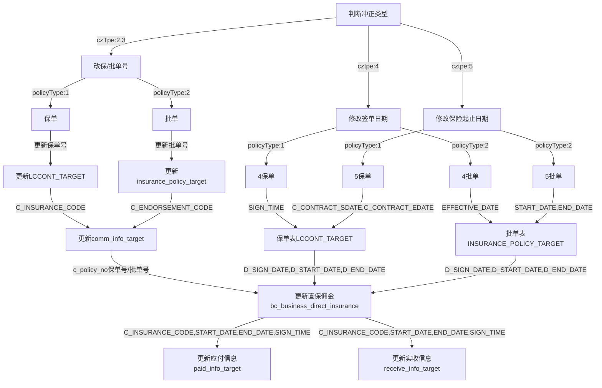

#  业管冲正逻辑图

## 接口参数:
参数名 | 中文名 | 类型 | 备注
---- | ---- | ---- | ---- 
oldPolicy | 老保单号 | String | 
newPolicy | 新保单号 | String | 
startDate | 保险起期 | String | 
endDate | 保险止期 | String | 
policyType | 保单类型 | 1:保单,2:批单 | 
czTpe | 冲正类型 | 2: 保单/批单号录入错误   3:重新出单，保单/批单号调整    4:签发日期录入错误  5: 保险期间/批单生效日期录入错误 | 
signTime | 签单时间 | String | 

## 冲正逻辑流程图

## 业管冲正问题

### 非核算项目修改

### 被保人冲正：
在一个单子有多个被保人的情况： 如旅意团险，医疗的集中投保等情况，业管没有全部的被保人信息，只有部分

目前意外险没有改被保人的情况

业管的被保人的使用情况： 只有在解付的时候展示使用

医疗的集中投保，分大保单，和小保单的情况

大保单是一个保单对应的多个被保人，被保人在业管的数据不全， 没有所有的被保人，只有部分

小保单，是每个医院都有一个保单，这样业管就有这个被保人

### 核算项目修改

#### 承保信息

- 目前业管没有承保信息， 只有结算信息。

冲正核算类型 1：非核算冲正， 2：核算冲正

冲正类型：11： 保单， 12：批单号， 13：签单日期， 14：起止期， 15：投保人， 16：被保人， 21：业务归属， 22：保批单， 23：保费， 24：结算信息

