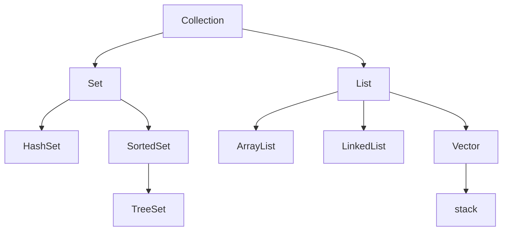
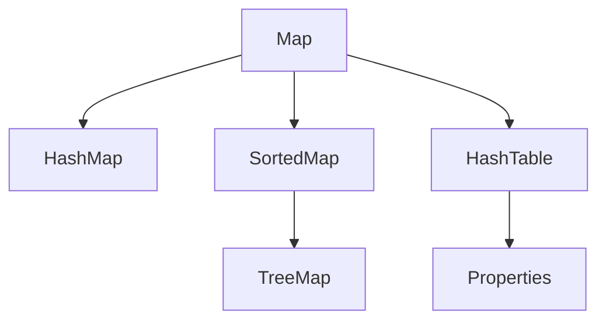
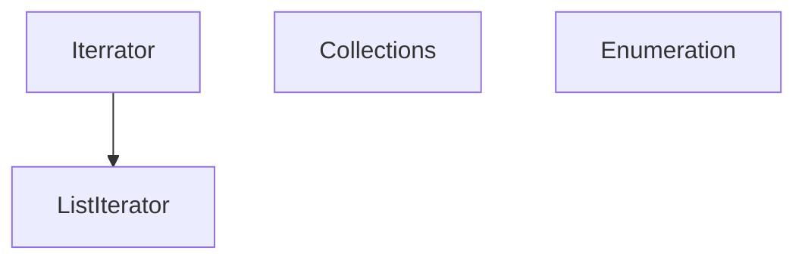

# 集合知识点
### Collection结构图

### ArrayList
- ArrayList 是一个数组队列，相当于 动态数组。与Java中的数组相比，它的容量能动态增长。它继承于AbstractList，实现了List, RandomAccess, Cloneable, java.io.Serializable这些接口。
- ArrayList 继承了AbstractList，实现了List。它是一个数组队列，提供了相关的添加、删除、修改、遍历等功能。
- ArrayList 实现了RandmoAccess接口，即提供了随机访问功能。RandmoAccess是java中用来被List实现，为List提供快速访问功能的。在ArrayList中，我们即可以通过元素的序号快速获取元素对象；这就是快速随机访问。稍后，我们会比较List的“快速随机访问”和“通过Iterator迭代器访问”的效率。
- ArrayList 实现了Cloneable接口，即覆盖了函数clone()，能被克隆。
- ArrayList 实现java.io.Serializable接口，这意味着ArrayList支持序列化，能通过序列化去传输。
- 和Vector不同，ArrayList中的操作不是线程安全的！所以，建议在单线程中才使用ArrayList，而在多线程中可以选择Vector或者CopyOnWriteArrayList。

#### ArrayList扩容机制
根据以下grow()方法的代码可以看出，扩容的话，是按照目前的list中的数据（elementData）的长度的一半进行扩容（oldCapacity >> 1， 右移一位，也就是除以2），也就是原来的1.5倍。
```java
private void grow(int minCapacity) {
    // overflow-conscious code
    int oldCapacity = elementData.length;
    int newCapacity = oldCapacity + (oldCapacity >> 1);
    if (newCapacity - minCapacity < 0)
    newCapacity = minCapacity;
    if (newCapacity - MAX_ARRAY_SIZE > 0)
    newCapacity = hugeCapacity(minCapacity);
    // minCapacity is usually close to size, so this is a win:
    elementData = Arrays.copyOf(elementData, newCapacity);
}
```
### LinkedList

### Map结构图


### 其他类结构图


