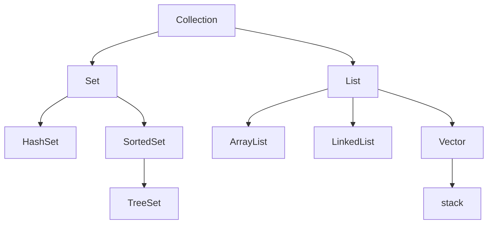
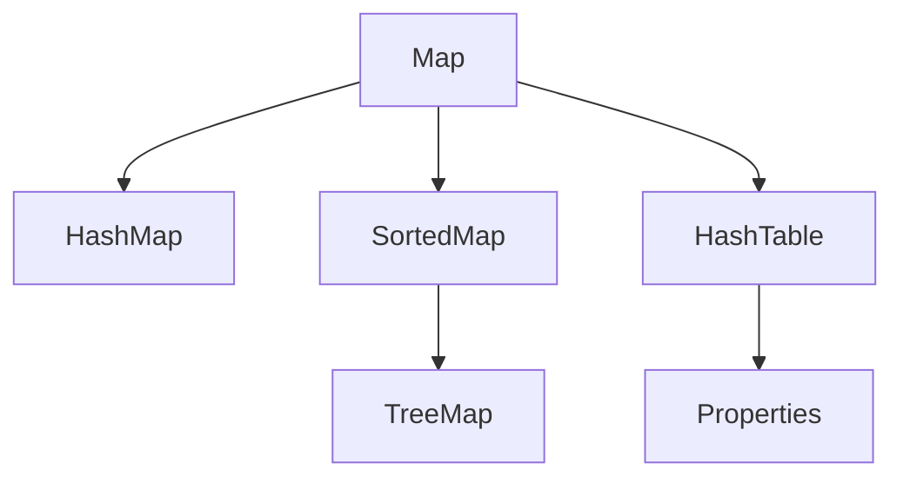
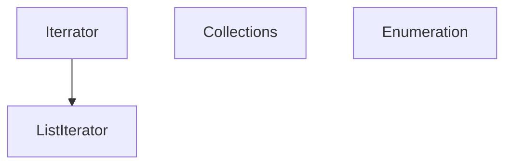

# 集合知识点
### Collection结构图

### ArrayList
- ArrayList 是一个数组队列，相当于 动态数组。与Java中的数组相比，它的容量能动态增长。它继承于AbstractList，实现了List, RandomAccess, Cloneable, java.io.Serializable这些接口。
- ArrayList 继承了AbstractList，实现了List。它是一个数组队列，提供了相关的添加、删除、修改、遍历等功能。
- ArrayList 实现了RandmoAccess接口，即提供了随机访问功能。RandmoAccess是java中用来被List实现，为List提供快速访问功能的。在ArrayList中，我们即可以通过元素的序号快速获取元素对象；这就是快速随机访问。稍后，我们会比较List的“快速随机访问”和“通过Iterator迭代器访问”的效率。
- ArrayList 实现了Cloneable接口，即覆盖了函数clone()，能被克隆。
- ArrayList 实现java.io.Serializable接口，这意味着ArrayList支持序列化，能通过序列化去传输。
- 和Vector不同，ArrayList中的操作不是线程安全的！所以，建议在单线程中才使用ArrayList，而在多线程中可以选择Vector或者CopyOnWriteArrayList。

#### ArrayList扩容机制
根据以下grow()方法的代码可以看出，扩容的话，是按照目前的list中的数据（elementData）的长度的一半进行扩容（oldCapacity >> 1， 右移一位，也就是除以2），也就是原来的1.5倍。
```java
private void grow(int minCapacity) {
    // overflow-conscious code
    int oldCapacity = elementData.length;
    int newCapacity = oldCapacity + (oldCapacity >> 1);
    if (newCapacity - minCapacity < 0)
    newCapacity = minCapacity;
    if (newCapacity - MAX_ARRAY_SIZE > 0)
    newCapacity = hugeCapacity(minCapacity);
    // minCapacity is usually close to size, so this is a win:
    elementData = Arrays.copyOf(elementData, newCapacity);
}
```
### LinkedList
- LinkedList 实际上是通过双向链表去实现的。它包含一个非常重要的内部类：Entry。Entry是双向链表节点所对应的数据结构，它包括的属性有：当前节点所包含的值，上一个节点，下一个节点。
- 从LinkedList的实现方式中可以发现，它不存在LinkedList容量不足的问题。
- LinkedList的克隆函数，即是将全部元素克隆到一个新的LinkedList对象中。
- LinkedList实现java.io.Serializable。当写入到输出流时，先写入“容量”，再依次写入“每一个节点保护的值”；当读出输入流时，先读取“容量”，再依次读取“每一个元素”。
- 由于LinkedList实现了Deque，而Deque接口定义了在双端队列两端访问元素的方法。提供插入、移除和检查元素的方法。每种方法都存在两种形式：一种形式在操作失败时抛出异常，另一种形式返回一个特殊值（null 或 false，具体取决于操作）。
#### LinkedList 使用注意
- LinkedList可以作为FIFO(先进先出)的队列，作为FIFO的队列时，下表的方法等价：
```
    队列方法       等效方法
    add(e)        addLast(e)
    offer(e)      offerLast(e)
    remove()      removeFirst()
    poll()        pollFirst()
    element()     getFirst()
    peek()        peekFirst()
```
- LinkedList可以作为LIFO(后进先出)的栈，作为LIFO的栈时，下表的方法等价：
```
    栈方法        等效方法
    push(e)      addFirst(e)
    pop()        removeFirst()
    peek()       peekFirst()
```
- LinkedList支持多种遍历方式。建议不要采用随机访问的方式去遍历LinkedList，而采用逐个遍历的方式。
- 推荐以下遍历方式
```java
for (Integer integ:list) 
```
### vector
- Vector 是矢量队列，它是JDK1.0版本添加的类。继承于AbstractList，实现了List, RandomAccess, Cloneable这些接口。
- Vector 继承了AbstractList，实现了List；所以，它是一个队列，支持相关的添加、删除、修改、遍历等功能。
- Vector 实现了RandmoAccess接口，即提供了随机访问功能。RandmoAccess是java中用来被List实现，为List提供快速访问功能的。在Vector中，我们即可以通过元素的序号快速获取元素对象；这就是快速随机访问。
- Vector 实现了Cloneable接口，即实现clone()函数。它能被克隆。
- Vector中的操作是线程安全的，和ArrayList不同，保证线程安全的方式是在对外提供的方法上面加上synchronixed关键字。
- Vector的数据结构和ArrayList差不多，它包含了3个成员变量：elementData , elementCount， capacityIncrement。
- elementData 是"Object[]类型的数组"，它保存了添加到Vector中的元素。elementData是个动态数组，如果初始化Vector时，没指定动态数组的>大小，则使用默认大小10。随着Vector中元素的增加，Vector的容量也会动态增长，capacityIncrement是与容量增长相关的增长系数，具体的增长方式，请参考源码分析中的ensureCapacity()函数。
```java
     // 确定Vector的容量。
     public synchronized void ensureCapacity(int minCapacity) {
         // 将Vector的改变统计数+1
         modCount++;
         ensureCapacityHelper(minCapacity);
     }
     // 确认“Vector容量”的帮助函数
     private void ensureCapacityHelper(int minCapacity) {
        int oldCapacity = elementData.length;
         // 当Vector的容量不足以容纳当前的全部元素，增加容量大小。
         // 若 容量增量系数>0(即capacityIncrement>0)，则将容量增大当capacityIncrement
         // 否则，将容量增大一倍。
         if (minCapacity > oldCapacity) {
             Object[] oldData = elementData;
             int newCapacity = (capacityIncrement > 0) ?
                 (oldCapacity + capacityIncrement) : (oldCapacity * 2);
             if (newCapacity < minCapacity) {
                 newCapacity = minCapacity;
             }
             elementData = Arrays.copyOf(elementData, newCapacity);
         }
     }
```
- elementCount 是动态数组的实际大小。
- capacityIncrement 是动态数组的增长系数。如果在创建Vector时，指定了capacityIncrement的大小；则，每次当Vector中动态数组容量增加时>，增加的大小都是capacityIncrement。
- Vector实际上是通过一个数组去保存数据的。当我们构造Vecotr时；若使用默认构造函数，则Vector的默认容量大小是10。
- 当Vector容量不足以容纳全部元素时，Vector的容量会增加。若容量增加系数 >0，则将容量的值增加“容量增加系数”；否则，将容量大小增加一倍。
- Vector的克隆函数，即是将全部元素克隆到一个数组中。
### Map结构图


### 其他类结构图


