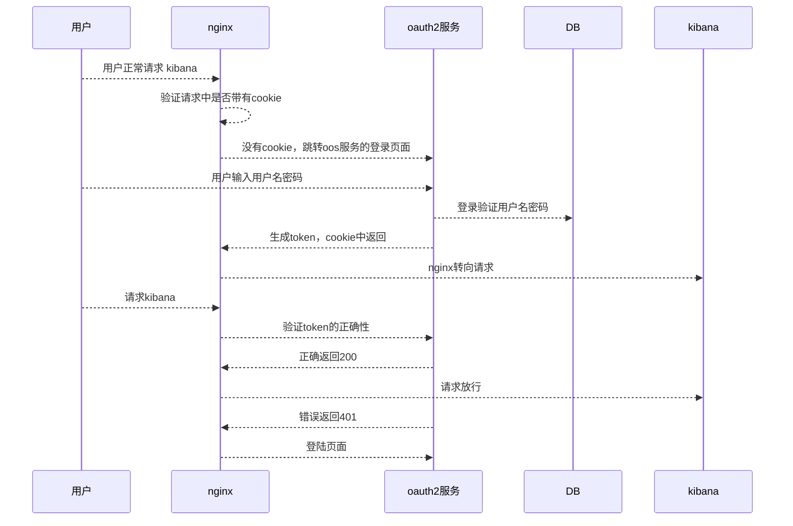
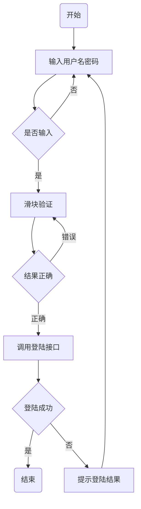

# 基于CAS的单点登陆
# 一致性hash

# 域名统一登陆

```mermaid
sequenceDiagram
    participant u as 用户
    participant n as nginx
    participant o as oauth2服务
    participant d as DB
    participant k as kibana

    u-->>n:用户正常请求 kibana
    n-->>n:验证请求中是否带有cookie
    n-->>o:没有cookie，跳转oos服务的登录页面
    u-->>o:用户输入用户名密码
    o-->>d:登录验证用户名密码
    o-->>n:生成token，cookie中返回
    n-->>k:nginx转向请求
    u-->>n:请求kibana
    n-->>o:验证token的正确性
    o-->>n:正确返回200
    n-->>k:请求放行
    o-->>n:错误返回401
    n-->>o:登陆页面
```

```mermaid
graph TD;
开始(开始) --> 输入[输入用户名密码];
输入-->是否已输入{是否输入};
是否已输入--否-->输入;
是否已输入--是-->验证[滑块验证];
验证-->验证结果{结果正确};
验证结果--正确-->登陆[调用登陆接口];
验证结果--错误-->验证;
登陆-->登陆结果{登陆成功};
登陆结果--是-->结束(结束);
登陆结果--否-->提示[提示登陆结果]-->输入;
```

# CAP定律

## C:一致性

## A:可用性

## P:分区容忍性